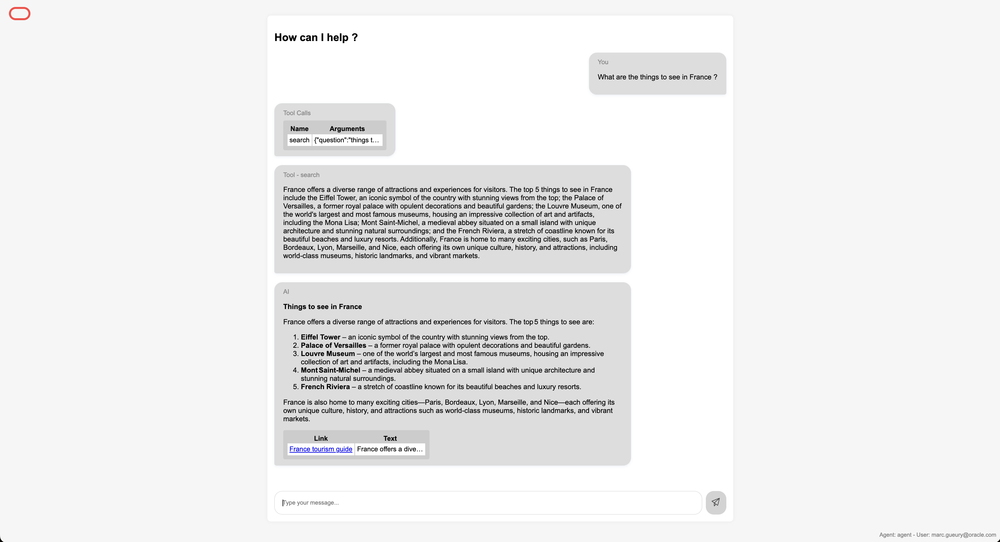
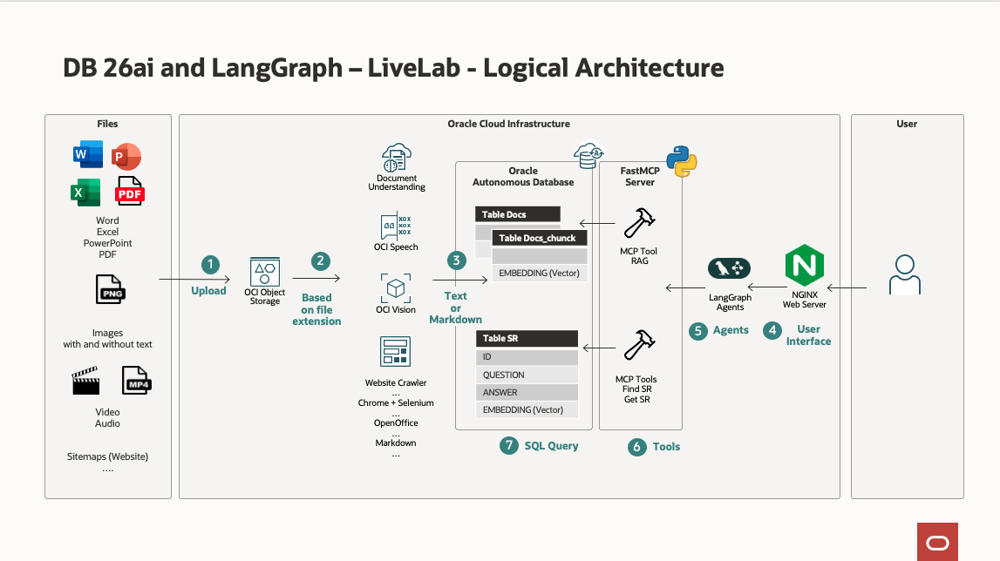
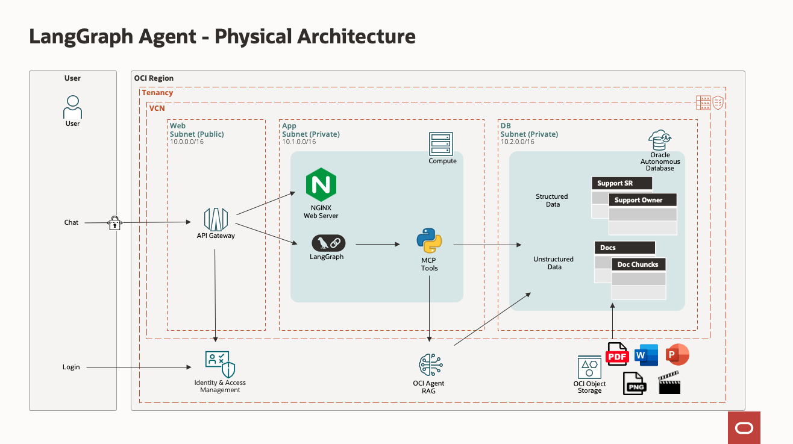
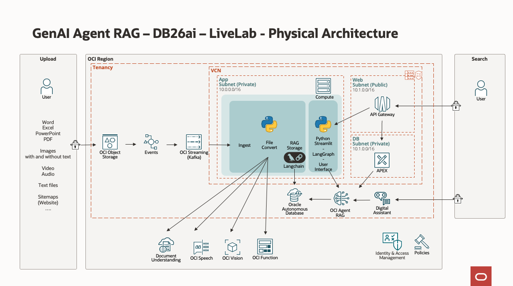
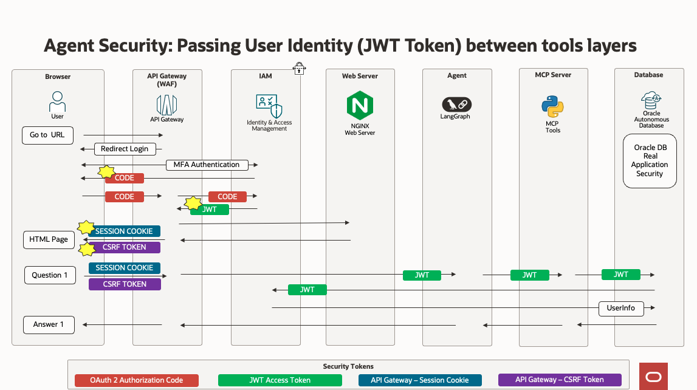

# Introduction

## About This Workshop

In this lab, we will build an Agent Chat. When asking a question to the agent, it will search for answers in:
- structured database tables 
- and unstructured documents (PDF, Word, ...)

To build it, we will use:
- LangGraph (Agent Framework)
- MCP Server (Tools)
- Database 26ai (with tables for Structured and Unstructured data)

An optional part adds security in-depth in the program by adding Identity Access and Management, user login, and passing the user information from the user interface to each layer and the database. This uses:
- OAuth2 / JWT Token 
- OCI API Gateway
- OCI Identity and Access Management
- Oracle Database Real Application security 

While the user interface is built with HTML or APEX, any user interface technology can be used (Streamlit, Visual Builder, Digital Assistant...)

In lab 1, the installation will be done with Terraform.

In lab 2 and 3, we will create several user interfaces using the following tools:
- APEX to manage the whole system,
- An HTML application to call the Agent
    
Estimated Workshop Time: 90 minutes

### **LangGraph Architecture**

This picture shows the processing of LangGraph from an end-user perspective.

    

It works like this:
1. Using a browser, the user navigates to a chat page (HTML page on a webserver)
2. (Optionally). The user logs in with OCI API Gateway, OCI Identity and Access Management, OAuth2
3. When asking a question, the question is sent to LangGraph 
4. LangGraph uses MCP Tools to answer to the question
5. Some of the Tools uses the database.
   - **Find Service Requests** uses structured tables
   - **RAG** uses unstructured data (documents)

### **Database Architecture**

This is the architecture from the database point or administrator point of view.

It works like this:
1. A document is uploaded to Object Storage by the administrator.
1. An event is raised and queued. The event is processed by a Python program running on a VM. Based on the file type, it will send the file to one or more AI services to enrich it and provide searchable text
1. The searchable text is chunked (cut into small pieces) and stored in the Database 26ai.
1. The user asks a question to an agent using a chat interface
1. The agent written in LangGraph chooses and calls the MCP tools to answer the question.
1. The tools process the agent’s call and, if required, call the database.
1. A SQL query runs in the database using (for example) Vectors and Embeddings.  

Here's how various file types are processed.

- If the file has the extension **.pdf**, **.txt**, **.csv**, **.md**, **.doc**, **.docx**, **.ppt**, **.pptx**, the file is transformed to MarkDown and stored in the database.
- If the file has the extension **.png**, **.jpg**, **.jpeg**, or **.gif**, it is processed by a MultiModal model. The output is stored in the database.
- If the file has the extension **.mp4**, **.avi**, **.mp3**, **.wav**, or **.m4a**, it is processed by OCI Speech.
- If the file has the extension **.tif**, it is processed by OCI Document Understanding.
- All other file types are sent to a generic binary file parser.

### **Physical Architecture**

We will install the following architecture using Terraform.

LangGraph physical Architecture:

DB26ai physical Architecture:

### **Security (Optional)**

If you choose to install the optional OpenID / OAuth2 configuration, the security will be like this.

    

The user will log in with OAuth2 and OCI Identity and Access Management. The OAuth2 token will pass from the user interface through all layers and the database. It allows to have these features:
- Login / Logout using OCI Identity and Access Management: 
    - Single Sign-On
    - Multifactor authentication
    - Federation
- Security with API Gateway 
    - JWT tokens internally
    - Session Cookie and CSRF token externally
- Oracle Database Real Application Security
    - Security on the tables and records based on user identity (ex: dynamic SQL where clause )

## Objectives

- Provision the services needed for the system
    - Compartment, Object Storage Bucket, Stream, Event, GenAI Agent, AI services, and a Virtual Machine
- Integrate the components into a working system
- Use the agent
- Understand how to build your own LangGraph, MCP server.

**Please proceed to the [next lab.](#next)**

## Acknowledgements 

- **Author**
    - Marc Gueury, Generative AI Specialist
