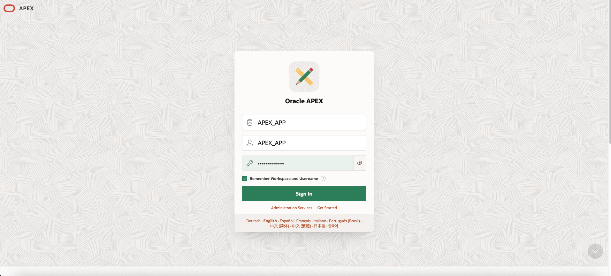
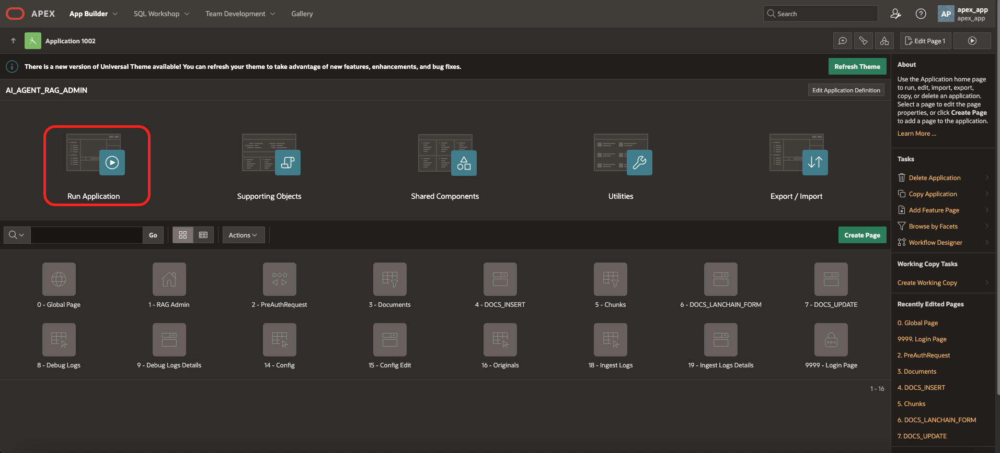
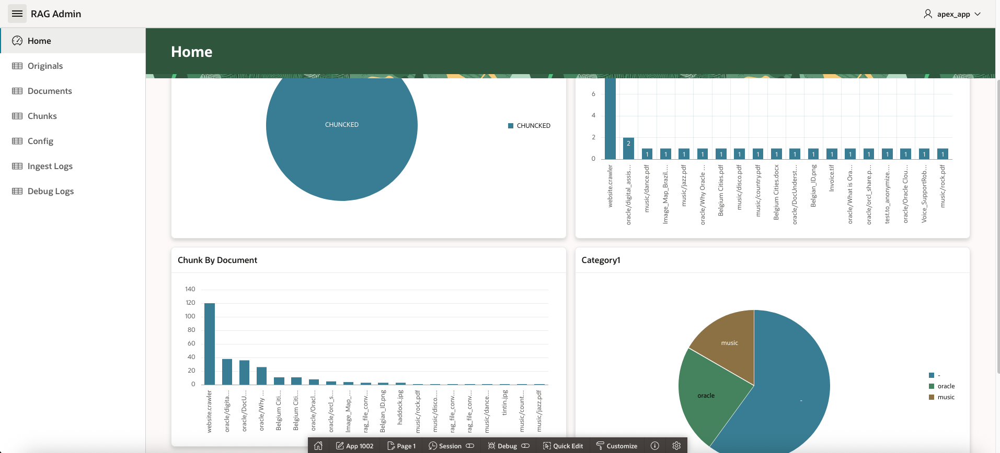
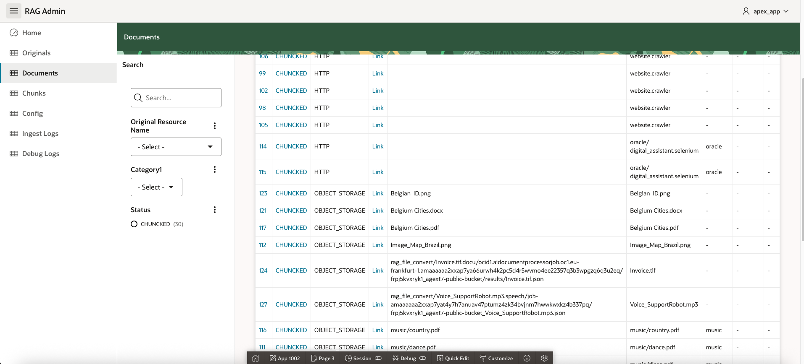

# Test with APEX

## Introduction
In this lab, we will test the installation using APEX
Estimated time: 10 minutes

### Objectives

- Test the program

### Prerequisites
- Lab 1 must have been completed.

## Task 1: Test RAG

1. Check the APEX URL and the User/Password at the end of the build log (or in starter/target/done.txt)
    
1. Go to the URL of the application (ex: https://abcdefghijklmnop.apigateway.eu-frankfurt-1.oci.customer-oci.com/ords/r/apex_app/apex_app/)

    Login as APEX\_APP / YOUR\_PASSWORD
    
1. Type "when was jazz created?" and then press *Enter*

    Hover over the citation. Note that you can see the page number. Click on the link.
        

1. Type "what is Oracle Analytics", then *Enter*

      

1. Try more questions:

    | File type | Extension | Question                                          |
    | ----------| --------- | ------------------------------------------------- |
    | PDF       | .pdf      | When was jazz created?                            |
    |           |           | What is Document Understanding?                   |
    | Word      | .docx     | What is OCI?                                      |
    | Image     | .png      | List the countries in the map of Brazil           |
    | Website   | .selenium | What is Digital Assistant?                        |
    | FAX       | .tif      | Is there an invoice for Optika?                   | 
    |           |           | What does the file invoice.tif contain?           |
    | Video     | .mp4      | What is Oracle Analytics?                         | 
    | Audio     | .mp3      | What is the issue with my headphones?             |

**You may now proceed to the [next lab.](#next)**

## Task 2. Check the content of the database.

1. Check the APEX URL and the workspace/username/password at the end of the build log.
    
1. Go to the URL of the application (ex: https://abcdefghijklmnop.apigateway.eu-frankfurt-1.oci.customer-oci.com/ords/_/landing)
    - Workspace: APEX_APP
    - User: APEX_APP
    - Password: YOUR\_PASSWORD

   

1. Click on APEX / Go 

1. Click on Application Builder.

1. Choose the Application *AI\_AGENT\_RAG\_ADMIN*

1.  Click *Run Application*

   

1. Login: APEX_APP / YOUR\_PASSWORD

1. If the indexing is finished, you will see this:

   

1. Check the menu: Original / Documents / Chunk to see how it is structured and parsed

   

## Task 3. Explore other APEX apps.

If you are familiar with APEX, do not hesitate to look at the other applications:
- AI\_AGENT\_RAG (see task 1)
- AI\_AGENT\_RAG\_ADMIN (see task 2)
- AI\_AGENT\_EVAL (allows you to test the quality of the agent)
- AI\_SUPPORT (allows you to edit and see the SR table used for the structured table case)

## Known issues

1. If your tenancy is not enabled for the Chicago region, image recognition will not work since. By default, image recognition uses the multimodal model of Grok running in Chicago.

## Acknowledgements

- **Author**
    - Marc Gueury, Generative AI Specialist
