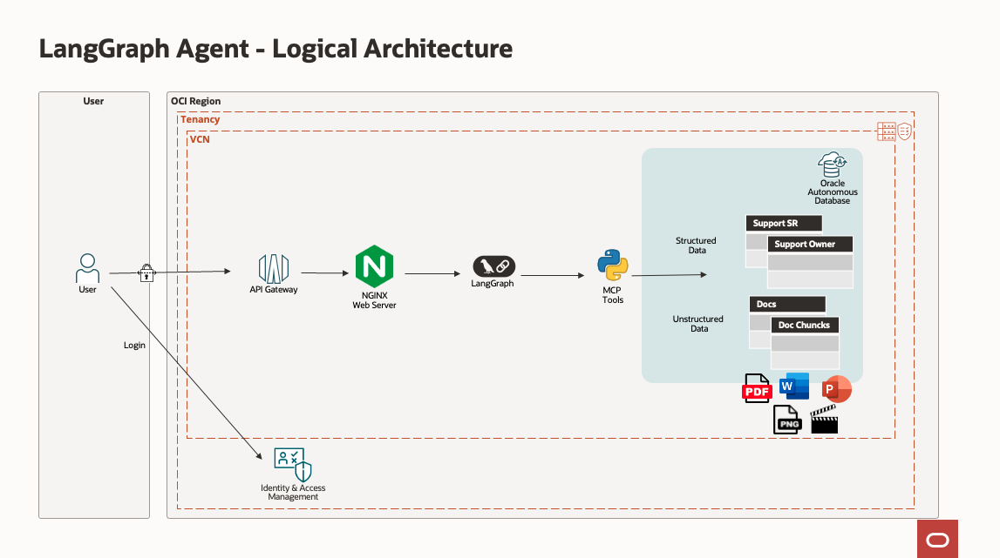
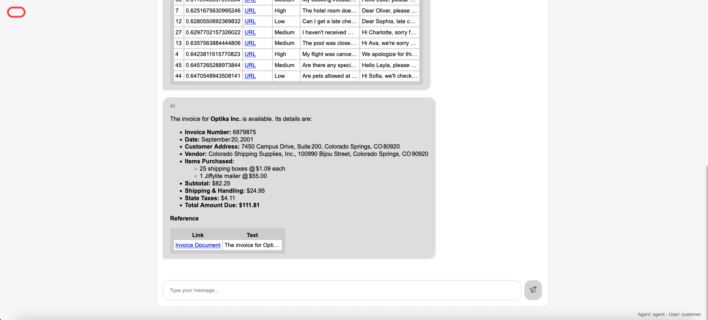
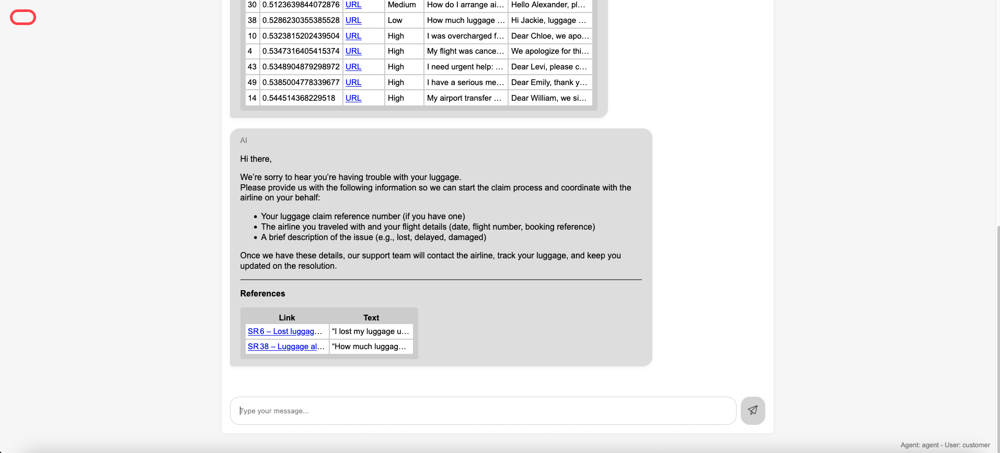
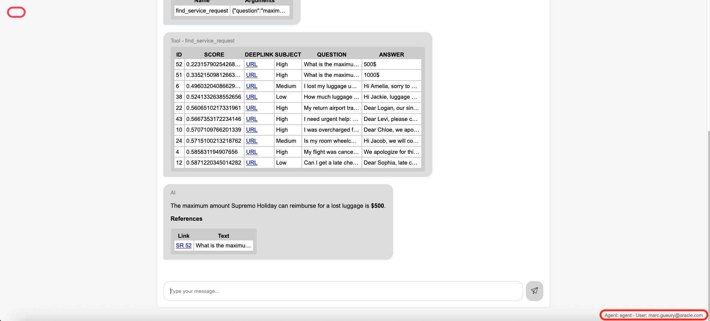
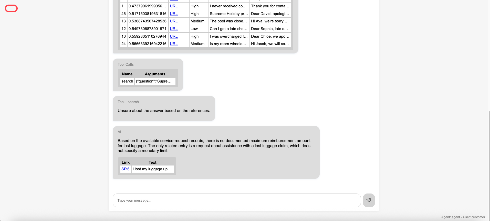

# Test with LangGraph

## Introduction
In this lab, we will test the installation using LangGraph

Estimated time: 10 min

### Objectives

- Test the program using LangGraph 

### Prerequisites
- Lab 1 must have been completed.

## Architecture

This is the architecture of the LangGraph application that we will use.

    

## Task 1: Test LangGraph

1. Check the "LangGraph Agent Chat" URL at the end of the terraform run (or in starter/target/done.txt)
    
1. Go to the URL (ex: https://xxxx.apigateway.eu-frankfurt-1.oci.customer-oci.com/xxxx/chat.html)
   
1. Type "Is there an invoice for Optika?", then *Enter*

    Hover on the citation. Note that you can see the page number. Click on the link.
        

    This response came from an unstructured documents (the file invoice.tif)

1.  Type: "I have an issue with my luggage"

        

    The response comes from structured data (service request). Ie, a record in the database SUPPORT_SR table.

## Task 2: Optional - Security 

If you installed OpenID:

1. Check the "LangGraph OpenID Chat" URL at the end of the terraform run (or in starter/target/done.txt)

1. Go to the URL (ex: https://xxxx.apigateway.eu-frankfurt-1.oci.customer-oci.com/openid/chat.html)

1. It will use the login from your current OCI Identity Domain. Log in with your OCI user credentials. You will see your name at the bottom of the page.

1.  Type: "What is the maximum amount to reimburse for lost luggage?"

1.  The agent will find the answer in the table SUPPORT_SR with a column *internal=1*. This table is protected by database security.

        

1. Try the same with the URL from task 1 without security. It will not have access to the internal SRs.

        

## Task 3: Optional - More questions

1.  Try more questions:

    | File type | Extension | Question                                          |
    | ----------| --------- | ------------------------------------------------- |
    | PDF       | .pdf      | When was jazz created ?                           |
    |           |           | What is Document Understanding                    |
    | Word      | .docx     | What is OCI ?                                     |
    | Image     | .png      | List the countries in the map of Brazil           |
    | Website   | .sitemap  | What is Digital Assistant ?                       |
    | Website   | .crawler  | What can I see in France ?                        |
    | FAX       | .tif      | Is there an invoice for Optika ?                  | 
    |           |           | What does the file invoice.tif contain?           |
    | Video     | .mp4      | What is Oracle Analytics                          | 
    | Audio     | .mp3      | What is the issue with my headphones ?            | 

## Task 4: Optional - Explore the LangGraph and MCP Tools source code

In the source code of the application that you have downloaded, look at the following files:
- starter/src/app/langgraph/src/agent.py
- starter/src/app/mcp\_server/mcp\_server\_rag.py

## END

Congratulations! You have finished the lab!!
We hope you have learned something useful.

## Known issues

None

## Acknowledgements

- **Author**
    - Marc Gueury, Generative AI Specialist

