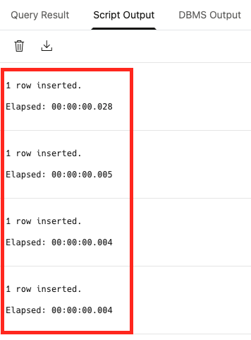
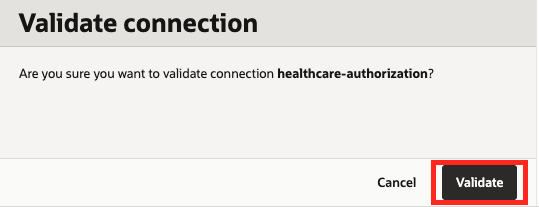
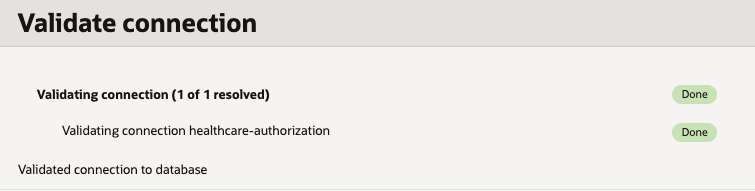

# Setup the database

## Introduction

In this lab, we are going to create an Autonomous Database instance (ADB), define the schema for patients and authorization requests, and insert seed data that the Healthcare Authorization Specialist Agent will query.

Estimated Time: 25 minutes

### Objectives

In this lab, you will:

- Create an ADB instance.
- Create the database schema.
- Insert data into the database.
- Create a vault to securely store the database connection information.
- Create a database connection.

### Prerequisites

This lab assumes you have:

- Completed the previous labs.

## Task 1: Create an ADB instance

In this task we are going to create a new ADB instance.

1. Click the navigation menu on the top left.
1. Click **Oracle Database**.
1. Click **Autonomous Database**.

   

1. Under the **List scope** section, make sure that the **root** compartment is selected.
1. Click the **Create Autonomous Database** button at the top of the **Autonomous Databases** table.

   

1. For the **Display name** use: _healthcare-authorization_.
1. For the **Database name** use: _healthcareauth_.
1. Under the **Compartment**, make sure that the **root** compartment is selected.
1. Under **Workload type** make sure that **Lakehouse** is selected.

   

1. Under the **Database configuration** section, enable the **Developer** option.
1. Select **23ai** as the version under **Choose database version**.

   

1. Under the **Administrator credentials creation** section, type a password (for example: _myPassword123_), in the **Password** field and confirm the password in the **Confirm password** field. Please make sure to choose a password you'd remember as we are going to need to type this password later.
1. Under the **Network access** section, make sure that the **Secure access from everywhere** option is selected.

   

1. Click the **Create** button at the bottom of the screen.

Once the database instance is created, you can move on to the next task (this may take a few minutes).

## Task 2: Create the database schema

In this task we are going to use SQL scripts to create the database schema which consists of tables and sequences (which will take care of inserting unique values for the various IDs like the authorization request ID or patient ID etc.).

1. Once the ADB instance is created, click the **Database actions** drop down and select the **SQL** option. This should launch a new tab in your browser with the SQL application (dismiss any messages if you see any).

   

1. Copy the following sql statements, paste them into the **SQL worksheet** and click the green **Run Statement** button at the top.

    ```sql
    <copy>
    CREATE TABLE Patients (
      PatientID          NUMBER PRIMARY KEY,
      ExternalPatientID  VARCHAR2(20) UNIQUE,
      FirstName          VARCHAR2(50) NOT NULL,
      LastName           VARCHAR2(50) NOT NULL,
      Address            VARCHAR2(200),
      City               VARCHAR2(50),
      State              VARCHAR2(2),
      ZipCode            VARCHAR2(10),
      Age                NUMBER,
      Gender             VARCHAR2(10),
      PrimaryInsurance   VARCHAR2(100),
      SecondaryInsurance VARCHAR2(100)
    );
    
    CREATE TABLE HealthcareSpecialists (
      SpecialistID NUMBER PRIMARY KEY,
      FirstName    VARCHAR2(50) NOT NULL,
      LastName     VARCHAR2(50) NOT NULL,
      Email        VARCHAR2(100) UNIQUE NOT NULL,
      Phone        VARCHAR2(20)
    );
    
    CREATE TABLE AuthorizationStatus (
      StatusID   NUMBER PRIMARY KEY,
      StatusName VARCHAR2(50) NOT NULL
    );
   
    CREATE TABLE AuthorizationRequests (
      AuthorizationID     NUMBER PRIMARY KEY,
      RequestID           NUMBER UNIQUE NOT NULL,
      PatientID           NUMBER NOT NULL,
      ServiceType         VARCHAR2(50) NOT NULL,
      RequestedService    VARCHAR2(200) NOT NULL,
      ClinicalJustification VARCHAR2(500),
      CreatedDate         DATE DEFAULT SYSTIMESTAMP NOT NULL,
      LastUpdatedDate     DATE DEFAULT SYSTIMESTAMP NOT NULL,
      StatusID            NUMBER NOT NULL,
      AssignedToSpecialistID NUMBER,
      DiagnosisCode       VARCHAR2(50),
      TreatingPhysician   VARCHAR2(100),
      UrgencyLevel        VARCHAR2(20),
      CONSTRAINT fk_ar_patient FOREIGN KEY (PatientID) REFERENCES Patients(PatientID),
      CONSTRAINT fk_ar_status  FOREIGN KEY (StatusID) REFERENCES AuthorizationStatus(StatusID),
      CONSTRAINT fk_ar_specialist FOREIGN KEY (AssignedToSpecialistID) REFERENCES HealthcareSpecialists(SpecialistID)
    );
    
    -- Sequences + Triggers
    CREATE SEQUENCE PatientSeq START WITH 1 INCREMENT BY 1;
    /
    CREATE OR REPLACE TRIGGER PatientTrigger
    BEFORE INSERT ON Patients
    FOR EACH ROW
    BEGIN
      SELECT PatientSeq.NEXTVAL INTO :NEW.PatientID FROM DUAL;
    END;
    /
    CREATE SEQUENCE SpecialistSeq START WITH 1 INCREMENT BY 1;
    /
    CREATE OR REPLACE TRIGGER SpecialistTrigger
    BEFORE INSERT ON HealthcareSpecialists
    FOR EACH ROW
    BEGIN
      SELECT SpecialistSeq.NEXTVAL INTO :NEW.SpecialistID FROM DUAL;
    END;
    /
    CREATE SEQUENCE AuthStatusSeq START WITH 1 INCREMENT BY 1;
    /
    CREATE OR REPLACE TRIGGER AuthStatusTrigger
    BEFORE INSERT ON AuthorizationStatus
    FOR EACH ROW
    BEGIN
      SELECT AuthStatusSeq.NEXTVAL INTO :NEW.StatusID FROM DUAL;
    END;
    /
    CREATE SEQUENCE AuthReqSeq START WITH 1 INCREMENT BY 1;
    /
    CREATE OR REPLACE TRIGGER AuthReqTrigger
    BEFORE INSERT ON AuthorizationRequests
    FOR EACH ROW
    BEGIN
      SELECT AuthReqSeq.NEXTVAL INTO :NEW.AuthorizationID FROM DUAL;
    END;
    /
    </copy>
    ```

   You should see an output similar to the following:

   

## Task 3: Insert data

In this task we are going to fill the database tables with data.
One after the other, copy each of the following SQL sections, <u>in order</u>, and paste each statement into the **SQL worksheet**, <u>replacing any existing text</u>. After the statement has been pasted, click the **Run Script** button.

   

It is important to make sure that you only copy & execute a single section at a time.
Don't forget to select all of the text in the worksheet before executing the statement.
After you execute a statement look for an output similar to the following:

   

1. Insert data into the **AuthorizationStatus** table:

    ```sql
    <copy>
    INSERT INTO AuthorizationStatus (StatusName) VALUES ('Pending Review');
    INSERT INTO AuthorizationStatus (StatusName) VALUES ('In Progress');
    INSERT INTO AuthorizationStatus (StatusName) VALUES ('Approved');
    INSERT INTO AuthorizationStatus (StatusName) VALUES ('Denied');
    </copy>
    ```

1. Insert data into the **HealthcareSpecialists** table:

    ```sql
    <copy>
    INSERT INTO HealthcareSpecialists (FirstName, LastName, Email, Phone)
    VALUES ('Emma','Johnson','emma.johnson@healthsystem.com','555-123-4567');
    INSERT INTO HealthcareSpecialists (FirstName, LastName, Email, Phone)
    VALUES ('Liam','Smith','liam.smith@healthsystem.com','555-234-5678');
    INSERT INTO HealthcareSpecialists (FirstName, LastName, Email, Phone)
    VALUES ('Olivia','Brown','olivia.brown@healthsystem.com','555-345-6789');
    INSERT INTO HealthcareSpecialists (FirstName, LastName, Email, Phone)
    VALUES ('Noah','Davis','noah.davis@healthsystem.com','555-456-7890');
    INSERT INTO HealthcareSpecialists (FirstName, LastName, Email, Phone)
    VALUES ('Sophia','Wilson','sophia.wilson@healthsystem.com','555-567-8901');
    INSERT INTO HealthcareSpecialists (FirstName, LastName, Email, Phone)
    VALUES ('Mason','Garcia','mason.garcia@healthsystem.com','555-678-9012');
    INSERT INTO HealthcareSpecialists (FirstName, LastName, Email, Phone)
    VALUES ('Isabella','Martinez','isabella.martinez@healthsystem.com','555-789-0123');
    INSERT INTO HealthcareSpecialists (FirstName, LastName, Email, Phone)
    VALUES ('Ethan','Lopez','ethan.lopez@healthsystem.com','555-890-1234');
    INSERT INTO HealthcareSpecialists (FirstName, LastName, Email, Phone)
    VALUES ('Ava','Hernandez','ava.hernandez@healthsystem.com','555-901-2345');
    INSERT INTO HealthcareSpecialists (FirstName, LastName, Email, Phone)
    VALUES ('James','Nguyen','james.nguyen@healthsystem.com','555-012-3456');
    </copy>
    ```

1. Insert data into the **Patients** table:

    ```sql
    <copy>
    INSERT INTO Patients (ExternalPatientID, FirstName, LastName, Address, City, State, ZipCode, Age, Gender, PrimaryInsurance, SecondaryInsurance)
    VALUES ('PAT_22000', 'Benjamin', 'Rodriguez', NULL, 'Houston', 'TX', '77001', 67, 'Male', 'Medicare', NULL);

    INSERT INTO Patients (ExternalPatientID, FirstName, LastName, Address, City, State, ZipCode, Age, Gender, PrimaryInsurance, SecondaryInsurance)
    VALUES ('PAT_30000', 'Emily', 'Davis', NULL, 'Boston', 'MA', '02108', 45, 'Female', 'Blue Cross', 'Medicare');

    INSERT INTO Patients (ExternalPatientID, FirstName, LastName, Address, City, State, ZipCode, Age, Gender, PrimaryInsurance, SecondaryInsurance)
    VALUES ('PAT_20000', 'Charlotte', 'Harris', NULL, 'Dallas', 'TX', '75201', 52, 'Female', 'UnitedHealthcare', NULL);

    INSERT INTO Patients (ExternalPatientID, FirstName, LastName, Address, City, State, ZipCode, Age, Gender, PrimaryInsurance, SecondaryInsurance)
    VALUES ('PAT_21000', 'Amelia', 'Martin', NULL, 'Denver', 'CO', '80204', 38, 'Female', 'Aetna', NULL);

    INSERT INTO Patients (ExternalPatientID, FirstName, LastName, Address, City, State, ZipCode, Age, Gender, PrimaryInsurance, SecondaryInsurance)
    VALUES ('PAT_28000', 'Evelyn', 'Garcia', NULL, 'Chicago', 'IL', '60610', 41, 'Female', 'Cigna', NULL);

    INSERT INTO Patients (ExternalPatientID, FirstName, LastName, Address, City, State, ZipCode, Age, Gender, PrimaryInsurance, SecondaryInsurance)
    VALUES ('PAT_13000', 'Shane', 'Thompson', NULL, 'Las Vegas', 'NV', '89101', 55, 'Male', 'Humana', NULL);

    INSERT INTO Patients (ExternalPatientID, FirstName, LastName, Address, City, State, ZipCode, Age, Gender, PrimaryInsurance, SecondaryInsurance)
    VALUES ('PAT_6000', 'Mason', 'Baker', NULL, 'Atlanta', 'GA', '30303', 60, 'Male', 'Medicare', 'AARP');

    INSERT INTO Patients (ExternalPatientID, FirstName, LastName, Address, City, State, ZipCode, Age, Gender, PrimaryInsurance, SecondaryInsurance)
    VALUES ('PAT_27000', 'Ava', 'Perez', NULL, 'Phoenix', 'AZ', '85001', 33, 'Female', 'Anthem', NULL);
    </copy>
    ```

1. Insert data into the **AuthorizationRequests** table:

    ```sql
    <copy>
    INSERT INTO AuthorizationRequests (RequestID, PatientID, ServiceType, RequestedService, ClinicalJustification, CreatedDate, LastUpdatedDate, StatusID, AssignedToSpecialistID, DiagnosisCode, TreatingPhysician, UrgencyLevel)
    SELECT 1005, p.PatientID, 'Imaging', 'MRI - Lumbar Spine', 'Chronic lower back pain, failed conservative treatment', TO_DATE('03-JUN-25','DD-MON-YY'), TO_DATE('16-JUN-25','DD-MON-YY'),
      (SELECT StatusID FROM AuthorizationStatus WHERE StatusName='Denied'), 1, 'M54.5', 'Dr. Sarah Mitchell', 'Standard'
    FROM Patients p WHERE p.ExternalPatientID='PAT_22000';

    INSERT INTO AuthorizationRequests (RequestID, PatientID, ServiceType, RequestedService, ClinicalJustification, CreatedDate, LastUpdatedDate, StatusID, AssignedToSpecialistID, DiagnosisCode, TreatingPhysician, UrgencyLevel)
    SELECT 1006, p.PatientID, 'Specialty Medication', 'Humira 40mg/0.8mL', 'Moderate to severe rheumatoid arthritis, inadequate response to methotrexate', TO_DATE('15-JUN-25','DD-MON-YY'), TO_DATE('30-JUN-25','DD-MON-YY'),
      (SELECT StatusID FROM AuthorizationStatus WHERE StatusName='Denied'), 2, 'M06.9', 'Dr. James Park', 'High'
    FROM Patients p WHERE p.ExternalPatientID='PAT_30000';

    INSERT INTO AuthorizationRequests (RequestID, PatientID, ServiceType, RequestedService, ClinicalJustification, CreatedDate, LastUpdatedDate, StatusID, AssignedToSpecialistID, DiagnosisCode, TreatingPhysician, UrgencyLevel)
    SELECT 1007, p.PatientID, 'Imaging', 'MRI - Brain with contrast', 'Persistent headaches, neurological symptoms', TO_DATE('16-JUN-25','DD-MON-YY'), TO_DATE('01-JUL-25','DD-MON-YY'),
      (SELECT StatusID FROM AuthorizationStatus WHERE StatusName='Approved'), 3, 'R51.9', 'Dr. Emily Chen', 'Urgent'
    FROM Patients p WHERE p.ExternalPatientID='PAT_20000';

    INSERT INTO AuthorizationRequests (RequestID, PatientID, ServiceType, RequestedService, ClinicalJustification, CreatedDate, LastUpdatedDate, StatusID, AssignedToSpecialistID, DiagnosisCode, TreatingPhysician, UrgencyLevel)
    SELECT 1008, p.PatientID, 'Surgery', 'Total knee replacement', 'Severe osteoarthritis, limited mobility', TO_DATE('16-JUL-25','DD-MON-YY'), TO_DATE('01-AUG-25','DD-MON-YY'),
      (SELECT StatusID FROM AuthorizationStatus WHERE StatusName='Pending Review'), 3, 'M17.11', 'Dr. Robert Taylor', 'Standard'
    FROM Patients p WHERE p.ExternalPatientID='PAT_21000';

    INSERT INTO AuthorizationRequests (RequestID, PatientID, ServiceType, RequestedService, ClinicalJustification, CreatedDate, LastUpdatedDate, StatusID, AssignedToSpecialistID, DiagnosisCode, TreatingPhysician, UrgencyLevel)
    SELECT 1011, p.PatientID, 'Specialty Medication', 'Dupixent 300mg', 'Severe atopic dermatitis uncontrolled with topical therapy', TO_DATE('16-AUG-25','DD-MON-YY'), TO_DATE('26-AUG-25','DD-MON-YY'),
      (SELECT StatusID FROM AuthorizationStatus WHERE StatusName='In Progress'), 5, 'L20.9', 'Dr. Maria Rodriguez', 'High'
    FROM Patients p WHERE p.ExternalPatientID='PAT_28000';

    INSERT INTO AuthorizationRequests (RequestID, PatientID, ServiceType, RequestedService, ClinicalJustification, CreatedDate, LastUpdatedDate, StatusID, AssignedToSpecialistID, DiagnosisCode, TreatingPhysician, UrgencyLevel)
    SELECT 1013, p.PatientID, 'Physical Therapy', 'Physical therapy - 12 sessions', 'Post-surgical rehabilitation following rotator cuff repair', TO_DATE('10-JUL-25','DD-MON-YY'), TO_DATE('20-JUL-25','DD-MON-YY'),
      (SELECT StatusID FROM AuthorizationStatus WHERE StatusName='Approved'), 7, 'M75.10', 'Dr. Kevin Lee', 'Standard'
    FROM Patients p WHERE p.ExternalPatientID='PAT_13000';

    INSERT INTO AuthorizationRequests (RequestID, PatientID, ServiceType, RequestedService, ClinicalJustification, CreatedDate, LastUpdatedDate, StatusID, AssignedToSpecialistID, DiagnosisCode, TreatingPhysician, UrgencyLevel)
    SELECT 1015, p.PatientID, 'Imaging', 'CT Scan - Chest', 'Evaluation of persistent cough and abnormal chest X-ray', TO_DATE('26-JUL-25','DD-MON-YY'), TO_DATE('01-AUG-25','DD-MON-YY'),
      (SELECT StatusID FROM AuthorizationStatus WHERE StatusName='Pending Review'), 10, 'R05.9', 'Dr. Lisa Wang', 'High'
    FROM Patients p WHERE p.ExternalPatientID='PAT_6000';
    </copy>
    ```

## Task 4: Create a Vault to securely store the database connection information

In this task we are going to create a Vault and an encryption key. We are going to use this vault to securely store the password used to connect to the database as a secret. This secret is going to be used in the next section by the database connection.

1. Click the navigation menu on the top left.
1. Click **Identity & Security**.
1. Click **Vault** under **Key Management & Secret Management**.

   

1. Under the **List scope** section, make sure that the **root** compartment is selected.
1. Click the **Create Vault** button at the top of the **Vaults** table.

   

1. Under the **Create in Compartment**, make sure that the **root** compartment is selected.
1. For the **Name** field use: _healthcare-authorization-secrets_
1. Click the **Create Vault** button at the bottom of the form.

   

1. Wait for the vault to be created.

   

1. Once the vault is created, click it's name from the **Vaults** list.
1. Under the **List scope** section, make sure that the **root** compartment is selected.
1. Click the **Create Key** button at the top of the **Master Encryption Keys** table.

   

1. Under the **Create in Compartment**, make sure that the **root** compartment is selected.
1. For the **Name** field use: _healthcare-authorization-key_
1. Click the **Create Key** button.

   

## Task 5: Create a database connection

In this section we are going to create a connection to our database. This connection is going to be used by the agent to retrieve information from the database.

1. Click the navigation menu on the top left.
1. Click **Developer Services**.
1. Click **Connections** under **Database Tools**.

   

1. Under the **List scope** section, make sure that the **root** compartment is selected.
1. Click the **Create Connection** button at the top of the **Connections** table.

   

1. For the **Name** field use: _healthcare-authorization_
1. Under the **Compartment**, make sure that the **root** compartment is selected.
1. Make sure that the **Select database** option is selected under the **Database details** section.
1. In the **Database cloud service** drop-down, select **Oracle Autonomous Database**.
1. In the **Database in...** drop down, select the **healthcare-authorization** database.
1. In the **Username** field, type: _ADMIN_

   

1. Under the **User password secret in...** drop-down, click the **Create password secret** button.

   

   This step will create a secret which will be stored in the Vault created earlier and will contain the password for connecting to the database.

1. For the **Name** field use: _healthcare-authorization-admin-password_
1. Select the **healthcare-authorization-secrets** in the **Vault in...** drop-down.
1. Select the **healthcare-authorization-key** in the **Encryption key in...** drop-down.
1. In the **User password** field, type the password you've used when you created the ADB instance.
1. Do the same in the **Confirm user password** field.
1. Click the **Create** button.

   

1. Back in the **Create connection** panel, the newly created password secret is automatically selected in the **User password secret in...** drop-down.

   

1. Under the **SSL details** section, click the **Create wallet content secret** button. This will create a secret which will help the agent securely communicate with the database.

   

1. For the **Name** field use: _healthcare-authorization-wallet-secret_
1. Select the **healthcare-authorization-secrets** in the **Vault in...** drop-down.
1. Select the **healthcare-authorization-key** in the **Encryption key in...** drop-down.
1. Under the **Wallet** section, select the **Retrieve regional wallet from Autonomous Database** option.
1. Click the **Create** button.

   

1. Back in the **Create connection** panel, the newly created wallet secret is automatically selected in the **SSO wallet content secret in...** drop-down.
1. Click the **Create** button.

   

## Task 6: Validate the connection

In this task we are going to make sure that the connection was created successfully.

1. After the connection was created, click **Validate** button on the top right of the connection page.

   

1. Click the **Validate** button at the bottom of the **Validate connection** dialog.

   

1. If everything was configured correctly, you should see a result similar to the following:

   

1. You can click the **Close** link to exit the dialog.

   

You may now **proceed to the next lab**

## Learn More

- [Provision an Autonomous Database Instance](https://docs.oracle.com/en-us/iaas/autonomous-database-serverless/doc/autonomous-provision.html)
- [Connect with Built-In Oracle Database Actions](https://docs.oracle.com/en/cloud/paas/autonomous-database/serverless/adbsb/connect-database-actions.html)
- [Creating a Vault](https://docs.oracle.com/en-us/iaas/Content/KeyManagement/Tasks/managingvaults_topic-To_create_a_new_vault.htm)
- [Creating a Master Encryption Key](https://docs.oracle.com/en-us/iaas/Content/KeyManagement/Tasks/managingkeys_topic-To_create_a_new_key.htm)
- [Database Tools - Creating a Connection](https://docs.oracle.com/en-us/iaas/database-tools/doc/creating-connection.html)

## Acknowledgements

- **Author** - Wynne Yang, Daniel Hart
- **Contributors** - Uma Kumar, Anthony Marino, Taylor Zheng, Deion Locklear, Hanna Rakhsha
- **Last Updated By/Date** - Wynne Yang Feb 2026