# Setup the Database

## Introduction

In this lab, we are going to create an Autonomous AI Database, define the schema for products, suppliers, stores, and return transactions, and insert seed data that the Merchandising Insights Agent will query.

**Estimated Time:** 25 minutes

### Objectives

In this lab, you will:

- Create an Autonomous AI Database instance.
- Create the database schema.
- Insert data into the database.
- Create a vault to securely store the database connection information.
- Create a database connection.

### Prerequisites

This lab assumes you have:

- Completed the previous labs.

## Task 1: Create an Autonomous AI Database instance

In this task we are going to create a new Autonomous AI Database instance.

1. Click the navigation menu on the top left.

2. Click **Oracle Database**.

3. Click **Autonomous AI Database**.

   

4. Under the **List scope** section, make sure that the root compartment is selected.

5. Click the **Create Autonomous AI Database** button at the top of the Autonomous AI Databases table.

   

6. For the **Display name** use:

    ```text
    retail-merchandising
    ```

7. For the **Database name** use:

    ```text
    retailmerchandising
    ```

8. Under the **Compartment**, make sure that the root compartment is selected.

9. Under **Workload type** make sure that **Lakehouse** is selected.

   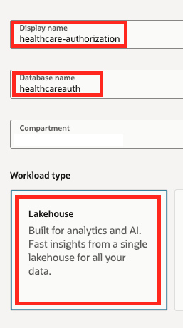

10. Under the **Database configuration** section, enable the **Developer** option.

11. Select **26ai** as the version under **Choose database version**.

   

12. Under the **Administrator credentials creation** section, type a password (for example: myPassword123), in the **Password** field and confirm the password in the **Confirm password** field. Please make sure to choose a password you'd remember as we are going to need to type this password later.

13. Under the **Network access** section, make sure that the **Secure access from everywhere** option is selected.

   

14. Click the **Create** button at the bottom of the screen.

Once the database instance is created, you can move on to the next task (this may take a few minutes).

## Task 2: Create the database schema

In this task we are going to use SQL scripts to create the database schema which consists of tables and sequences for our retail merchandising system.

1. Once the Autonomous AI Database instance is created, click the **Database actions** drop down and select the **SQL** option. This should launch a new tab in your browser with the SQL application (dismiss any messages if you see any).

   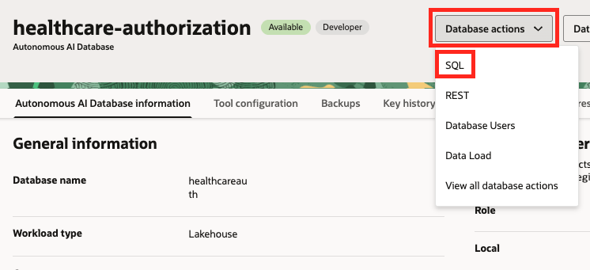

2. Copy the following SQL statements, paste them into the SQL worksheet and click the green **Run Script** button at the top.

    ```sql
    -- Create Suppliers table
    CREATE TABLE Suppliers (
        SupplierID           NUMBER PRIMARY KEY,
        SupplierName         VARCHAR2(100) NOT NULL,
        ContactEmail         VARCHAR2(100),
        ContactPhone         VARCHAR2(20),
        Region               VARCHAR2(50),
        QualityRating        NUMBER(2,1),
        ContractStatus       VARCHAR2(20),
        DefectReturnCount    NUMBER DEFAULT 0,
        LastQualityReview    DATE,
        QualityStatus        VARCHAR2(20)
    );

    -- Create Products table
    CREATE TABLE Products (
        ProductID            NUMBER PRIMARY KEY,
        SKU                  VARCHAR2(20) UNIQUE NOT NULL,
        ProductName          VARCHAR2(100) NOT NULL,
        Category             VARCHAR2(50),
        SubCategory          VARCHAR2(50),
        SupplierID           NUMBER NOT NULL,
        UnitCost             NUMBER(10,2),
        UnitPrice            NUMBER(10,2),
        LaunchDate           DATE,
        CONSTRAINT fk_prod_supplier FOREIGN KEY (SupplierID) REFERENCES Suppliers(SupplierID)
    );

    -- Create Stores table
    CREATE TABLE Stores (
        StoreID              NUMBER PRIMARY KEY,
        StoreName            VARCHAR2(100) NOT NULL,
        City                 VARCHAR2(50),
        State                VARCHAR2(2),
        Region               VARCHAR2(50),
        StoreType            VARCHAR2(20)
    );

    -- Create Return_Reasons table
    CREATE TABLE Return_Reasons (
        ReasonID             NUMBER PRIMARY KEY,
        ReasonCode           VARCHAR2(20) NOT NULL,
        ReasonDescription    VARCHAR2(100) NOT NULL,
        ReasonCategory       VARCHAR2(50)
    );

    -- Create Return_Transactions table
    CREATE TABLE Return_Transactions (
        ReturnID             NUMBER PRIMARY KEY,
        TransactionID        VARCHAR2(20) UNIQUE NOT NULL,
        ProductID            NUMBER NOT NULL,
        StoreID              NUMBER NOT NULL,
        ReasonID             NUMBER NOT NULL,
        ReturnDate           DATE NOT NULL,
        QuantityReturned     NUMBER DEFAULT 1,
        RefundAmount         NUMBER(10,2),
        ReturnCondition      VARCHAR2(20),
        DispositionAction    VARCHAR2(20),
        RTVClaimed           VARCHAR2(3),
        CONSTRAINT fk_rt_product FOREIGN KEY (ProductID) REFERENCES Products(ProductID),
        CONSTRAINT fk_rt_store FOREIGN KEY (StoreID) REFERENCES Stores(StoreID),
        CONSTRAINT fk_rt_reason FOREIGN KEY (ReasonID) REFERENCES Return_Reasons(ReasonID)
    );

    -- Create Sequences
    CREATE SEQUENCE supplier_seq START WITH 100 INCREMENT BY 1;
    CREATE SEQUENCE product_seq START WITH 1000 INCREMENT BY 1;
    CREATE SEQUENCE store_seq START WITH 1 INCREMENT BY 1;
    CREATE SEQUENCE reason_seq START WITH 1 INCREMENT BY 1;
    CREATE SEQUENCE return_seq START WITH 5000 INCREMENT BY 1;
    ```

You should see an output similar to the following:

   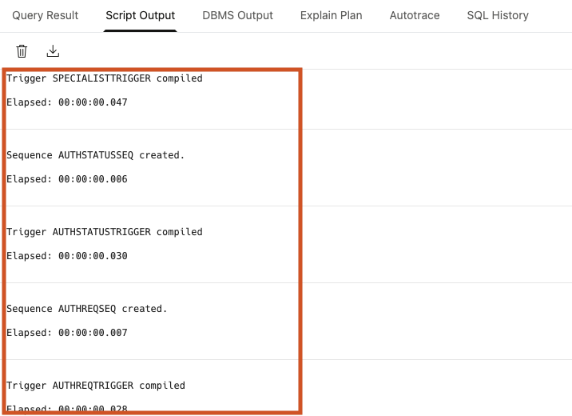

## Task 3: Insert data

In this task we are going to fill the database tables with data. One after the other, copy each of the following SQL sections, in order, and paste each statement into the SQL worksheet, replacing any existing text. After the statement has been pasted, click the **Run Script** button.

   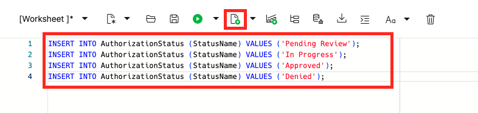

> **Important:** Make sure that you only copy & execute a single section at a time. Don't forget to select all of the text in the worksheet before executing the statement.

   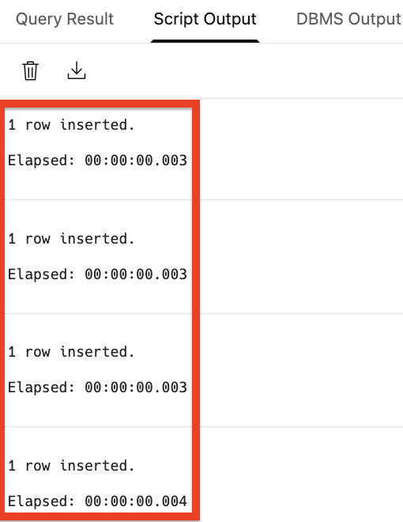

1. Insert data into the **Return_Reasons** table:

    ```sql
    INSERT INTO Return_Reasons (ReasonID, ReasonCode, ReasonDescription, ReasonCategory) VALUES
    (1, 'DEF001', 'Defective product - does not function', 'Defect');
    INSERT INTO Return_Reasons (ReasonID, ReasonCode, ReasonDescription, ReasonCategory) VALUES
    (2, 'DEF002', 'Missing parts or accessories', 'Defect');
    INSERT INTO Return_Reasons (ReasonID, ReasonCode, ReasonDescription, ReasonCategory) VALUES
    (3, 'DMG001', 'Damaged in shipping', 'Damage');
    INSERT INTO Return_Reasons (ReasonID, ReasonCode, ReasonDescription, ReasonCategory) VALUES
    (4, 'PRF001', 'Changed mind - no longer needed', 'Preference');
    INSERT INTO Return_Reasons (ReasonID, ReasonCode, ReasonDescription, ReasonCategory) VALUES
    (5, 'PRF002', 'Wrong size or color', 'Preference');
    INSERT INTO Return_Reasons (ReasonID, ReasonCode, ReasonDescription, ReasonCategory) VALUES
    (6, 'WRG001', 'Wrong item received', 'Wrong Item');

    COMMIT;
    ```

2. Insert data into the **Suppliers** table:

    ```sql
    INSERT INTO Suppliers (SupplierID, SupplierName, ContactEmail, ContactPhone, Region, QualityRating, ContractStatus, DefectReturnCount, LastQualityReview, QualityStatus) VALUES
    (100, 'Premier Appliances Inc', 'quality@premierapp.com', '555-0100', 'Midwest', 4.6, 'Active', 3, DATE '2025-06-15', 'Good Standing');
    INSERT INTO Suppliers (SupplierID, SupplierName, ContactEmail, ContactPhone, Region, QualityRating, ContractStatus, DefectReturnCount, LastQualityReview, QualityStatus) VALUES
    (101, 'TechFlow Electronics', 'support@techflow.com', '555-0101', 'West', 4.2, 'Active', 8, DATE '2025-05-20', 'Good Standing');
    INSERT INTO Suppliers (SupplierID, SupplierName, ContactEmail, ContactPhone, Region, QualityRating, ContractStatus, DefectReturnCount, LastQualityReview, QualityStatus) VALUES
    (102, 'ValueParts Manufacturing', 'vendor@valueparts.com', '555-0102', 'Southeast', 2.3, 'Probation', 32, DATE '2025-08-01', 'Probation');
    INSERT INTO Suppliers (SupplierID, SupplierName, ContactEmail, ContactPhone, Region, QualityRating, ContractStatus, DefectReturnCount, LastQualityReview, QualityStatus) VALUES
    (103, 'HomeStyle Goods', 'orders@homestyle.com', '555-0103', 'Northeast', 3.8, 'Active', 6, DATE '2025-04-10', 'Good Standing');
    INSERT INTO Suppliers (SupplierID, SupplierName, ContactEmail, ContactPhone, Region, QualityRating, ContractStatus, DefectReturnCount, LastQualityReview, QualityStatus) VALUES
    (104, 'QuickShip Distributors', 'contact@quickship.com', '555-0104', 'Southwest', 3.1, 'Active', 18, DATE '2025-07-22', 'Under Review');
    INSERT INTO Suppliers (SupplierID, SupplierName, ContactEmail, ContactPhone, Region, QualityRating, ContractStatus, DefectReturnCount, LastQualityReview, QualityStatus) VALUES
    (105, 'Reliable Home Products', 'sales@reliablehome.com', '555-0105', 'Midwest', 4.4, 'Active', 4, DATE '2025-03-18', 'Good Standing');
    INSERT INTO Suppliers (SupplierID, SupplierName, ContactEmail, ContactPhone, Region, QualityRating, ContractStatus, DefectReturnCount, LastQualityReview, QualityStatus) VALUES
    (106, 'Budget Electronics Co', 'info@budgetelec.com', '555-0106', 'West', 2.1, 'Probation', 28, DATE '2025-08-15', 'Probation');
    INSERT INTO Suppliers (SupplierID, SupplierName, ContactEmail, ContactPhone, Region, QualityRating, ContractStatus, DefectReturnCount, LastQualityReview, QualityStatus) VALUES
    (107, 'Apex Furniture Group', 'vendor@apexfurn.com', '555-0107', 'Northeast', 4.0, 'Active', 5, DATE '2025-05-05', 'Good Standing');

    COMMIT;
    ```

3. Insert data into the **Stores** table:

    ```sql
    INSERT INTO Stores (StoreID, StoreName, City, State, Region, StoreType) VALUES
    (1, 'Seer Retail Manhattan', 'New York', 'NY', 'Northeast', 'Flagship');
    INSERT INTO Stores (StoreID, StoreName, City, State, Region, StoreType) VALUES
    (2, 'Seer Retail Boston', 'Boston', 'MA', 'Northeast', 'Standard');
    INSERT INTO Stores (StoreID, StoreName, City, State, Region, StoreType) VALUES
    (3, 'Seer Retail Atlanta', 'Atlanta', 'GA', 'Southeast', 'Flagship');
    INSERT INTO Stores (StoreID, StoreName, City, State, Region, StoreType) VALUES
    (4, 'Seer Retail Miami', 'Miami', 'FL', 'Southeast', 'Standard');
    INSERT INTO Stores (StoreID, StoreName, City, State, Region, StoreType) VALUES
    (5, 'Seer Retail Chicago', 'Chicago', 'IL', 'Midwest', 'Flagship');
    INSERT INTO Stores (StoreID, StoreName, City, State, Region, StoreType) VALUES
    (6, 'Seer Retail Detroit', 'Detroit', 'MI', 'Midwest', 'Standard');
    INSERT INTO Stores (StoreID, StoreName, City, State, Region, StoreType) VALUES
    (7, 'Seer Retail Dallas', 'Dallas', 'TX', 'Southwest', 'Flagship');
    INSERT INTO Stores (StoreID, StoreName, City, State, Region, StoreType) VALUES
    (8, 'Seer Retail Phoenix', 'Phoenix', 'AZ', 'Southwest', 'Standard');
    INSERT INTO Stores (StoreID, StoreName, City, State, Region, StoreType) VALUES
    (9, 'Seer Retail Los Angeles', 'Los Angeles', 'CA', 'West', 'Flagship');
    INSERT INTO Stores (StoreID, StoreName, City, State, Region, StoreType) VALUES
    (10, 'Seer Retail Seattle', 'Seattle', 'WA', 'West', 'Standard');

    COMMIT;
    ```

4. Insert data into the **Products** table:

    ```sql
    -- Disable substitution variables (required for & in product names)
    SET DEFINE OFF;

    INSERT INTO Products (ProductID, SKU, ProductName, Category, SubCategory, SupplierID, UnitCost, UnitPrice, LaunchDate) VALUES
    (1001, 'APP-ESP-001', 'Espresso Maker Model A', 'Appliances', 'Coffee & Espresso', 102, 89.99, 179.99, DATE '2024-06-01');
    INSERT INTO Products (ProductID, SKU, ProductName, Category, SubCategory, SupplierID, UnitCost, UnitPrice, LaunchDate) VALUES
    (1002, 'APP-BLD-002', 'ProBlend Blender 3000', 'Appliances', 'Blenders', 100, 45.00, 89.99, DATE '2024-03-15');
    INSERT INTO Products (ProductID, SKU, ProductName, Category, SubCategory, SupplierID, UnitCost, UnitPrice, LaunchDate) VALUES
    (1003, 'APP-TOA-003', 'SmartToast 4-Slice', 'Appliances', 'Toasters', 100, 32.00, 64.99, DATE '2024-01-20');
    INSERT INTO Products (ProductID, SKU, ProductName, Category, SubCategory, SupplierID, UnitCost, UnitPrice, LaunchDate) VALUES
    (1004, 'ELC-TV-001', 'UltraView 55" Smart TV', 'Electronics', 'Televisions', 101, 320.00, 599.99, DATE '2024-04-01');
    INSERT INTO Products (ProductID, SKU, ProductName, Category, SubCategory, SupplierID, UnitCost, UnitPrice, LaunchDate) VALUES
    (1005, 'ELC-SPK-002', 'SoundWave Bluetooth Speaker', 'Electronics', 'Audio', 101, 28.00, 59.99, DATE '2024-02-10');
    INSERT INTO Products (ProductID, SKU, ProductName, Category, SubCategory, SupplierID, UnitCost, UnitPrice, LaunchDate) VALUES
    (1006, 'ELC-TAB-003', 'TabletPro 10.5"', 'Electronics', 'Tablets', 106, 180.00, 349.99, DATE '2024-05-20');
    INSERT INTO Products (ProductID, SKU, ProductName, Category, SubCategory, SupplierID, UnitCost, UnitPrice, LaunchDate) VALUES
    (1007, 'HMG-VAC-001', 'PowerClean Robot Vacuum', 'Home Goods', 'Vacuums', 105, 125.00, 249.99, DATE '2024-07-01');
    INSERT INTO Products (ProductID, SKU, ProductName, Category, SubCategory, SupplierID, UnitCost, UnitPrice, LaunchDate) VALUES
    (1008, 'HMG-AIR-002', 'FreshAir Purifier', 'Home Goods', 'Air Quality', 105, 75.00, 149.99, DATE '2024-08-15');
    INSERT INTO Products (ProductID, SKU, ProductName, Category, SubCategory, SupplierID, UnitCost, UnitPrice, LaunchDate) VALUES
    (1009, 'HMG-LMP-003', 'SmartGlow Floor Lamp', 'Home Goods', 'Lighting', 103, 42.00, 89.99, DATE '2024-03-01');
    INSERT INTO Products (ProductID, SKU, ProductName, Category, SubCategory, SupplierID, UnitCost, UnitPrice, LaunchDate) VALUES
    (1010, 'FRN-SOF-001', 'ComfortPlus Sofa', 'Furniture', 'Living Room', 107, 450.00, 899.99, DATE '2024-02-01');
    INSERT INTO Products (ProductID, SKU, ProductName, Category, SubCategory, SupplierID, UnitCost, UnitPrice, LaunchDate) VALUES
    (1011, 'FRN-DSK-002', 'ErgoDesk Standing Desk', 'Furniture', 'Office', 107, 280.00, 549.99, DATE '2024-04-10');
    INSERT INTO Products (ProductID, SKU, ProductName, Category, SubCategory, SupplierID, UnitCost, UnitPrice, LaunchDate) VALUES
    (1012, 'ELC-HPH-004', 'ProSound Headphones', 'Electronics', 'Audio', 106, 55.00, 119.99, DATE '2024-06-15');
    INSERT INTO Products (ProductID, SKU, ProductName, Category, SubCategory, SupplierID, UnitCost, UnitPrice, LaunchDate) VALUES
    (1013, 'APP-MWV-004', 'QuickHeat Microwave', 'Appliances', 'Microwaves', 104, 68.00, 129.99, DATE '2024-05-01');
    INSERT INTO Products (ProductID, SKU, ProductName, Category, SubCategory, SupplierID, UnitCost, UnitPrice, LaunchDate) VALUES
    (1014, 'HMG-FAN-004', 'TurboBreeze Tower Fan', 'Home Goods', 'Fans', 104, 38.00, 79.99, DATE '2024-07-20');
    INSERT INTO Products (ProductID, SKU, ProductName, Category, SubCategory, SupplierID, UnitCost, UnitPrice, LaunchDate) VALUES
    (1015, 'ELC-CAM-005', 'SecureView Home Camera', 'Electronics', 'Security', 101, 65.00, 129.99, DATE '2024-08-01');

    COMMIT;
    ```

5. Insert data into the **Return_Transactions** table:

    ```sql
    -- Espresso Maker returns (8 total - high return rate scenario)
    INSERT INTO Return_Transactions (ReturnID, TransactionID, ProductID, StoreID, ReasonID, ReturnDate, QuantityReturned, RefundAmount, ReturnCondition, DispositionAction, RTVClaimed) VALUES
    (5001, 'RTN-2025-0001', 1001, 7, 1, DATE '2025-07-15', 1, 179.99, 'Defective', 'RTV', 'Yes');
    INSERT INTO Return_Transactions (ReturnID, TransactionID, ProductID, StoreID, ReasonID, ReturnDate, QuantityReturned, RefundAmount, ReturnCondition, DispositionAction, RTVClaimed) VALUES
    (5002, 'RTN-2025-0002', 1001, 8, 2, DATE '2025-07-18', 1, 179.99, 'Defective', 'RTV', 'Yes');
    INSERT INTO Return_Transactions (ReturnID, TransactionID, ProductID, StoreID, ReasonID, ReturnDate, QuantityReturned, RefundAmount, ReturnCondition, DispositionAction, RTVClaimed) VALUES
    (5003, 'RTN-2025-0003', 1001, 3, 1, DATE '2025-07-22', 1, 179.99, 'Defective', 'RTV', 'No');
    INSERT INTO Return_Transactions (ReturnID, TransactionID, ProductID, StoreID, ReasonID, ReturnDate, QuantityReturned, RefundAmount, ReturnCondition, DispositionAction, RTVClaimed) VALUES
    (5004, 'RTN-2025-0004', 1001, 5, 2, DATE '2025-07-25', 1, 179.99, 'Defective', 'RTV', 'Yes');
    INSERT INTO Return_Transactions (ReturnID, TransactionID, ProductID, StoreID, ReasonID, ReturnDate, QuantityReturned, RefundAmount, ReturnCondition, DispositionAction, RTVClaimed) VALUES
    (5005, 'RTN-2025-0005', 1001, 1, 1, DATE '2025-08-01', 1, 179.99, 'Defective', 'RTV', 'No');
    INSERT INTO Return_Transactions (ReturnID, TransactionID, ProductID, StoreID, ReasonID, ReturnDate, QuantityReturned, RefundAmount, ReturnCondition, DispositionAction, RTVClaimed) VALUES
    (5006, 'RTN-2025-0006', 1001, 9, 2, DATE '2025-08-05', 1, 179.99, 'Defective', 'RTV', 'Yes');
    INSERT INTO Return_Transactions (ReturnID, TransactionID, ProductID, StoreID, ReasonID, ReturnDate, QuantityReturned, RefundAmount, ReturnCondition, DispositionAction, RTVClaimed) VALUES
    (5007, 'RTN-2025-0007', 1001, 4, 4, DATE '2025-08-10', 1, 179.99, 'Opened', 'Outlet', 'No');
    INSERT INTO Return_Transactions (ReturnID, TransactionID, ProductID, StoreID, ReasonID, ReturnDate, QuantityReturned, RefundAmount, ReturnCondition, DispositionAction, RTVClaimed) VALUES
    (5008, 'RTN-2025-0008', 1001, 7, 1, DATE '2025-08-12', 1, 179.99, 'Defective', 'RTV', 'No');

    -- TabletPro returns (from Budget Electronics - probation supplier)
    INSERT INTO Return_Transactions (ReturnID, TransactionID, ProductID, StoreID, ReasonID, ReturnDate, QuantityReturned, RefundAmount, ReturnCondition, DispositionAction, RTVClaimed) VALUES
    (5009, 'RTN-2025-0009', 1006, 1, 1, DATE '2025-07-20', 1, 349.99, 'Defective', 'RTV', 'Yes');
    INSERT INTO Return_Transactions (ReturnID, TransactionID, ProductID, StoreID, ReasonID, ReturnDate, QuantityReturned, RefundAmount, ReturnCondition, DispositionAction, RTVClaimed) VALUES
    (5010, 'RTN-2025-0010', 1006, 2, 1, DATE '2025-07-28', 1, 349.99, 'Defective', 'RTV', 'Yes');
    INSERT INTO Return_Transactions (ReturnID, TransactionID, ProductID, StoreID, ReasonID, ReturnDate, QuantityReturned, RefundAmount, ReturnCondition, DispositionAction, RTVClaimed) VALUES
    (5011, 'RTN-2025-0011', 1006, 5, 2, DATE '2025-08-03', 1, 349.99, 'Defective', 'RTV', 'No');

    -- Southwest shipping damage pattern
    INSERT INTO Return_Transactions (ReturnID, TransactionID, ProductID, StoreID, ReasonID, ReturnDate, QuantityReturned, RefundAmount, ReturnCondition, DispositionAction, RTVClaimed) VALUES
    (5012, 'RTN-2025-0012', 1004, 7, 3, DATE '2025-07-10', 1, 599.99, 'Damaged', 'RTV', 'Yes');
    INSERT INTO Return_Transactions (ReturnID, TransactionID, ProductID, StoreID, ReasonID, ReturnDate, QuantityReturned, RefundAmount, ReturnCondition, DispositionAction, RTVClaimed) VALUES
    (5013, 'RTN-2025-0013', 1010, 7, 3, DATE '2025-07-14', 1, 899.99, 'Damaged', 'RTV', 'Yes');
    INSERT INTO Return_Transactions (ReturnID, TransactionID, ProductID, StoreID, ReasonID, ReturnDate, QuantityReturned, RefundAmount, ReturnCondition, DispositionAction, RTVClaimed) VALUES
    (5014, 'RTN-2025-0014', 1007, 8, 3, DATE '2025-07-19', 1, 249.99, 'Damaged', 'RTV', 'No');
    INSERT INTO Return_Transactions (ReturnID, TransactionID, ProductID, StoreID, ReasonID, ReturnDate, QuantityReturned, RefundAmount, ReturnCondition, DispositionAction, RTVClaimed) VALUES
    (5015, 'RTN-2025-0015', 1008, 8, 3, DATE '2025-08-02', 1, 149.99, 'Damaged', 'Dispose', 'No');
    INSERT INTO Return_Transactions (ReturnID, TransactionID, ProductID, StoreID, ReasonID, ReturnDate, QuantityReturned, RefundAmount, ReturnCondition, DispositionAction, RTVClaimed) VALUES
    (5016, 'RTN-2025-0016', 1011, 7, 3, DATE '2025-08-08', 1, 549.99, 'Damaged', 'RTV', 'Yes');

    -- Normal returns from other regions
    INSERT INTO Return_Transactions (ReturnID, TransactionID, ProductID, StoreID, ReasonID, ReturnDate, QuantityReturned, RefundAmount, ReturnCondition, DispositionAction, RTVClaimed) VALUES
    (5017, 'RTN-2025-0017', 1005, 1, 4, DATE '2025-07-12', 1, 59.99, 'Opened', 'Outlet', 'No');
    INSERT INTO Return_Transactions (ReturnID, TransactionID, ProductID, StoreID, ReasonID, ReturnDate, QuantityReturned, RefundAmount, ReturnCondition, DispositionAction, RTVClaimed) VALUES
    (5018, 'RTN-2025-0018', 1009, 3, 4, DATE '2025-07-16', 1, 89.99, 'New', 'Restock', 'No');
    INSERT INTO Return_Transactions (ReturnID, TransactionID, ProductID, StoreID, ReasonID, ReturnDate, QuantityReturned, RefundAmount, ReturnCondition, DispositionAction, RTVClaimed) VALUES
    (5019, 'RTN-2025-0019', 1002, 5, 4, DATE '2025-07-21', 1, 89.99, 'New', 'Restock', 'No');
    INSERT INTO Return_Transactions (ReturnID, TransactionID, ProductID, StoreID, ReasonID, ReturnDate, QuantityReturned, RefundAmount, ReturnCondition, DispositionAction, RTVClaimed) VALUES
    (5020, 'RTN-2025-0020', 1012, 9, 1, DATE '2025-07-24', 1, 119.99, 'Defective', 'RTV', 'Yes');
    INSERT INTO Return_Transactions (ReturnID, TransactionID, ProductID, StoreID, ReasonID, ReturnDate, QuantityReturned, RefundAmount, ReturnCondition, DispositionAction, RTVClaimed) VALUES
    (5021, 'RTN-2025-0021', 1003, 2, 6, DATE '2025-07-27', 1, 64.99, 'New', 'Restock', 'No');
    INSERT INTO Return_Transactions (ReturnID, TransactionID, ProductID, StoreID, ReasonID, ReturnDate, QuantityReturned, RefundAmount, ReturnCondition, DispositionAction, RTVClaimed) VALUES
    (5022, 'RTN-2025-0022', 1015, 10, 4, DATE '2025-07-30', 1, 129.99, 'Opened', 'Outlet', 'No');
    INSERT INTO Return_Transactions (ReturnID, TransactionID, ProductID, StoreID, ReasonID, ReturnDate, QuantityReturned, RefundAmount, ReturnCondition, DispositionAction, RTVClaimed) VALUES
    (5023, 'RTN-2025-0023', 1013, 6, 2, DATE '2025-08-04', 1, 129.99, 'Defective', 'RTV', 'No');
    INSERT INTO Return_Transactions (ReturnID, TransactionID, ProductID, StoreID, ReasonID, ReturnDate, QuantityReturned, RefundAmount, ReturnCondition, DispositionAction, RTVClaimed) VALUES
    (5024, 'RTN-2025-0024', 1014, 4, 3, DATE '2025-08-07', 1, 79.99, 'Damaged', 'Dispose', 'No');
    INSERT INTO Return_Transactions (ReturnID, TransactionID, ProductID, StoreID, ReasonID, ReturnDate, QuantityReturned, RefundAmount, ReturnCondition, DispositionAction, RTVClaimed) VALUES
    (5025, 'RTN-2025-0025', 1004, 3, 4, DATE '2025-08-09', 1, 599.99, 'Opened', 'Outlet', 'No');
    INSERT INTO Return_Transactions (ReturnID, TransactionID, ProductID, StoreID, ReasonID, ReturnDate, QuantityReturned, RefundAmount, ReturnCondition, DispositionAction, RTVClaimed) VALUES
    (5026, 'RTN-2025-0026', 1007, 1, 4, DATE '2025-08-11', 1, 249.99, 'New', 'Restock', 'No');
    INSERT INTO Return_Transactions (ReturnID, TransactionID, ProductID, StoreID, ReasonID, ReturnDate, QuantityReturned, RefundAmount, ReturnCondition, DispositionAction, RTVClaimed) VALUES
    (5027, 'RTN-2025-0027', 1012, 5, 2, DATE '2025-08-13', 1, 119.99, 'Defective', 'RTV', 'No');
    INSERT INTO Return_Transactions (ReturnID, TransactionID, ProductID, StoreID, ReasonID, ReturnDate, QuantityReturned, RefundAmount, ReturnCondition, DispositionAction, RTVClaimed) VALUES
    (5028, 'RTN-2025-0028', 1005, 6, 5, DATE '2025-08-14', 1, 59.99, 'New', 'Restock', 'No');

    COMMIT;
    ```

6. Run the following verification query to confirm the data was inserted correctly:

    ```sql
    SELECT 'Return_Reasons' AS TableName, COUNT(*) AS RecordCount FROM Return_Reasons
    UNION ALL SELECT 'Suppliers', COUNT(*) FROM Suppliers
    UNION ALL SELECT 'Stores', COUNT(*) FROM Stores
    UNION ALL SELECT 'Products', COUNT(*) FROM Products
    UNION ALL SELECT 'Return_Transactions', COUNT(*) FROM Return_Transactions;
    ```

    You should see the following counts:

    - Return_Reasons: 6
    - Suppliers: 8
    - Stores: 10
    - Products: 15
    - Return_Transactions: 28

## Task 4: Create a Vault to securely store the database connection information

In this task we are going to create a Vault and an encryption key. We are going to use this vault to securely store the password used to connect to the database as a secret.

1. Click the navigation menu on the top left.

2. Click **Identity & Security**.

3. Click **Vault** under Key Management & Secret Management.

   

4. Under the **List scope** section, make sure that the root compartment is selected.

5. Click the **Create Vault** button at the top of the Vaults table.

   

6. Under the **Create in Compartment**, make sure that the root compartment is selected.

7. For the **Name** field use:

    ```text
    retail-merchandising-secrets
    ```

8. Click the **Create Vault** button at the bottom of the form.

   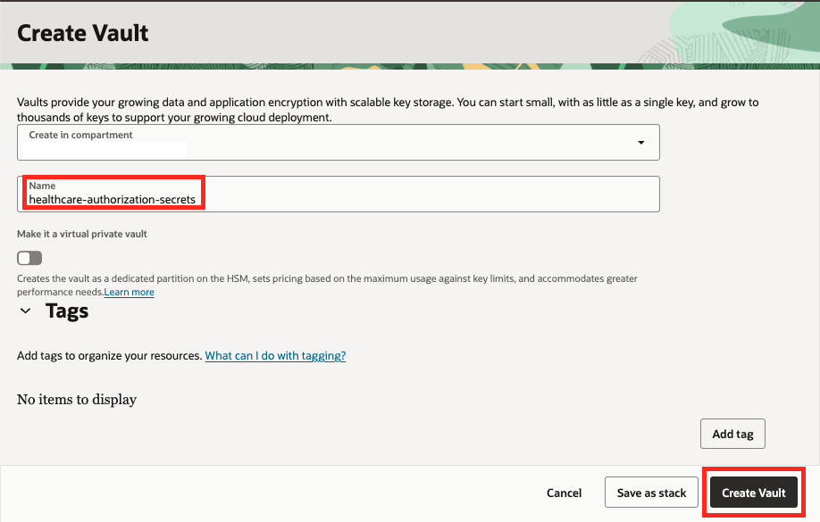

9. Wait for the vault to be created.

   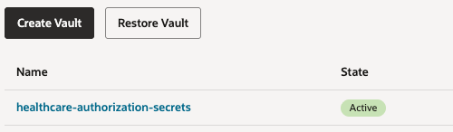

10. Once the vault is created, click its name from the Vaults list.

11. Under the **List scope** section, make sure that the root compartment is selected.

12. Click the **Create Key** button at the top of the Master Encryption Keys table.

   

13. Under the **Create in Compartment**, make sure that the root compartment is selected.

14. For the **Name** field use:

    ```text
    retail-merchandising-key
    ```

15. Click the **Create Key** button.

   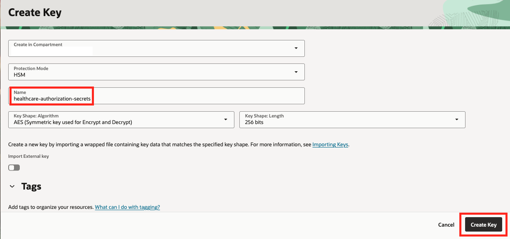

## Task 5: Create a database connection

In this section we are going to create a connection to our database. This connection is going to be used by the agent to retrieve information from the database.

1. Click the navigation menu on the top left.

2. Click **Developer Services**.

3. Click **Connections** under Database Tools.

   

4. Under the **List scope** section, make sure that the root compartment is selected.

5. Click the **Create Connection** button at the top of the Connections table.

   

6. For the **Name** field use:

    ```text
    retail-merchandising
    ```

7. Under the **Compartment**, make sure that the root compartment is selected.

8. Make sure that the **Select database** option is selected under the Database details section.

9. In the **Database cloud service** drop-down, select **Oracle Autonomous AI Database**.

10. In the **Database in...** drop down, select the **retail-merchandising** database.

11. In the **Username** field, type:

    ```text
    ADMIN
    ```

   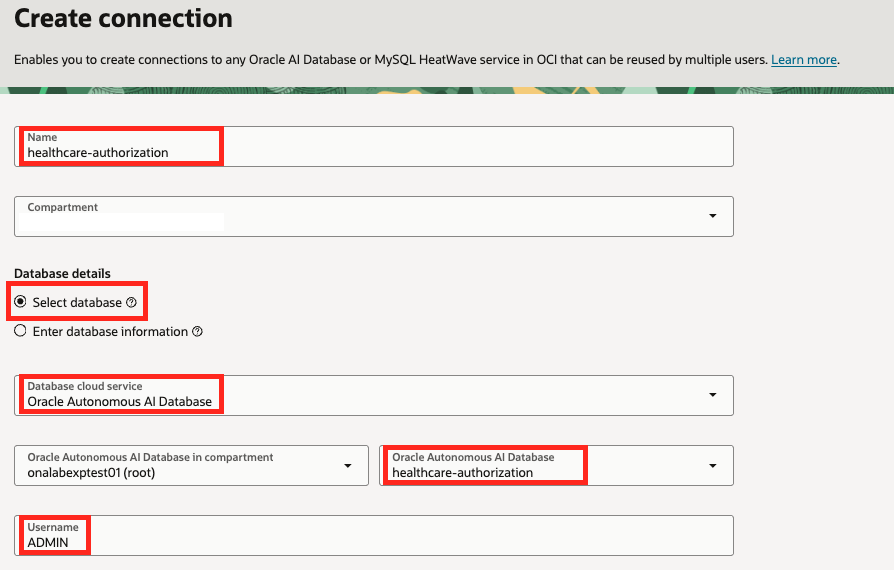

12. Under the **User password secret in...** drop-down, click the **Create password secret** button.

   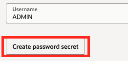

    This step will create a secret which will be stored in the Vault created earlier and will contain the password for connecting to the database.

13. For the **Name** field use:

    ```text
    retail-merchandising-admin-password
    ```

14. Select the **retail-merchandising-secrets** in the **Vault in...** drop-down.

15. Select the **retail-merchandising-key** in the **Encryption key in...** drop-down.

16. In the **User password** field, type the password you've used when you created the ADB instance.


17. Do the same in the **Confirm user password** field.

18. Click the **Create** button.


   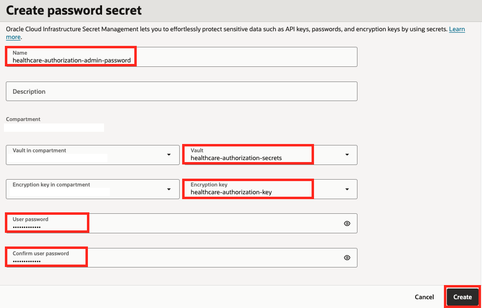


19. Back in the Create connection panel, the newly created password secret is automatically selected in the **User password secret in...** drop-down.

   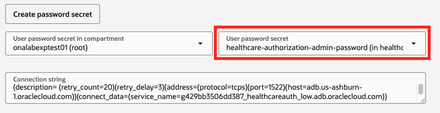

20. Under the **SSL details** section, click the **Create wallet content secret** button. This will create a secret which will help the agent securely communicate with the database.

    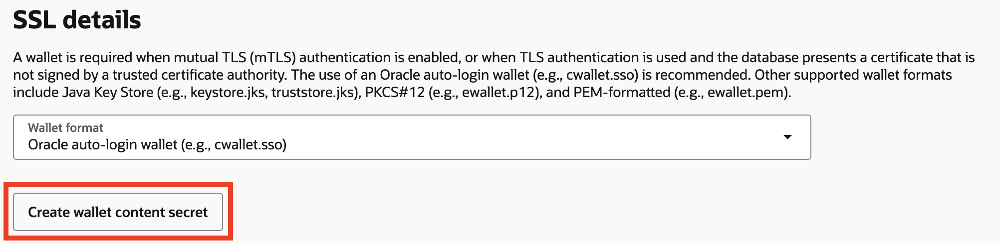


21. For the **Name** field use:

    ```text
    retail-merchandising-wallet-secret
    ```

22. Select the **retail-merchandising-secrets** in the **Vault in...** drop-down.

23. Select the **retail-merchandising-key** in the **Encryption key in...** drop-down.

24. Under the **Wallet** section, select the **Retrieve regional wallet from Autonomous Database** option.

25. Click the **Create** button.

   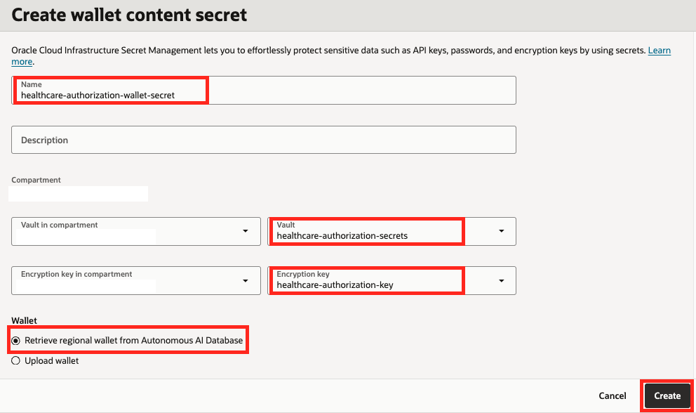
   
   

26. Back in the Create connection panel, the newly created wallet secret is automatically selected in the **SSO wallet content secret in...** drop-down.

27. Click the **Create** button.
   
   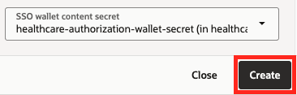


## Task 6: Validate the connection

In this task we are going to make sure that the connection was created successfully.

1. After the connection was created, click **Validate** button on the top right of the connection page.

   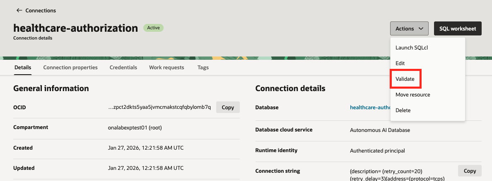

2. Click the **Validate** button at the bottom of the Validate connection dialog.

    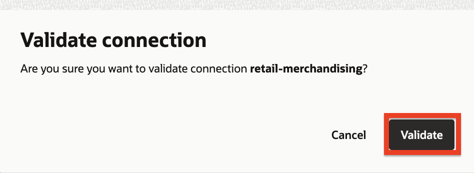

3. If everything was configured correctly, you should see a successful validation result.

   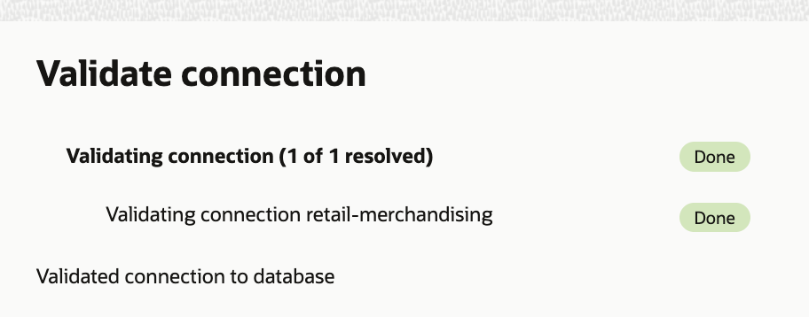

4. You can click the **Close** link to exit the dialog.

   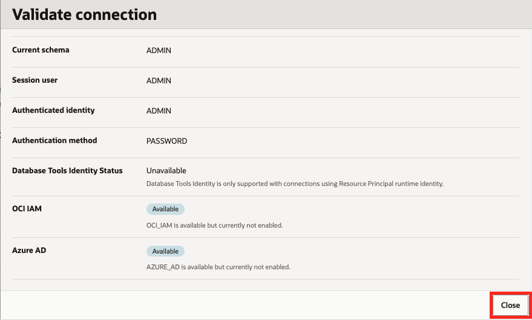

You may now proceed to the next lab.

## Learn More

- [Provision an Autonomous AI Database Instance](https://docs.oracle.com/en-us/iaas/autonomous-database-shared/doc/autonomous-provision.html)
- [Connect with Built-In Oracle Database Actions](https://docs.oracle.com/en-us/iaas/autonomous-database-shared/doc/sql-developer-web.html)
- [Creating a Vault](https://docs.oracle.com/en-us/iaas/Content/KeyManagement/Tasks/managingvaults.htm)
- [Creating a Master Encryption Key](https://docs.oracle.com/en-us/iaas/Content/KeyManagement/Tasks/managingkeys.htm)
- [Database Tools - Creating a Connection](https://docs.oracle.com/en-us/iaas/database-tools/doc/creating-connection.html)


## Acknowledgements

- **Author** - Deion Locklear, Yanir Shahak
- **Contributors** - Uma Kumar, Hanna Rakhsha, Daniel Hart, Anthony Marino