# Lab 3: Create the Agent

## Introduction

In this lab we are going to create the intelligent agent which will drive our entire solution. We will provide the agent with the required tools and knowledge bases to perform its work effectively. Tools are resources the agent can use to perform its tasks. In our use-case, we are going to use two tools:

- **RAG Tool** - Which will scan the merchandising policy documents uploaded to object storage whenever the user requires such information.
- **SQL Tool** - Which will be able to retrieve information stored in our database instance relating to products, suppliers, stores, and return transactions.

**Estimated Time:** 15 minutes

### Objectives

In this lab, you will:

- Create our agent including the RAG & SQL Tools and assign the relevant knowledge base to each.

### Prerequisites

This lab assumes you have:

- All previous labs successfully completed.

## Task 1: Create the agent

1. In the OCI Console, click the **Region** selector in the top-right corner and switch to **US Midwest (Chicago)** for this workshop.

   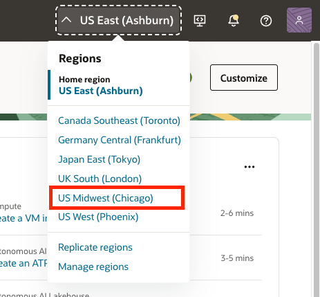

2. Click the navigation menu on the top left.

3. Click **Analytics & AI**.

4. Click **Generative AI Agents**.

   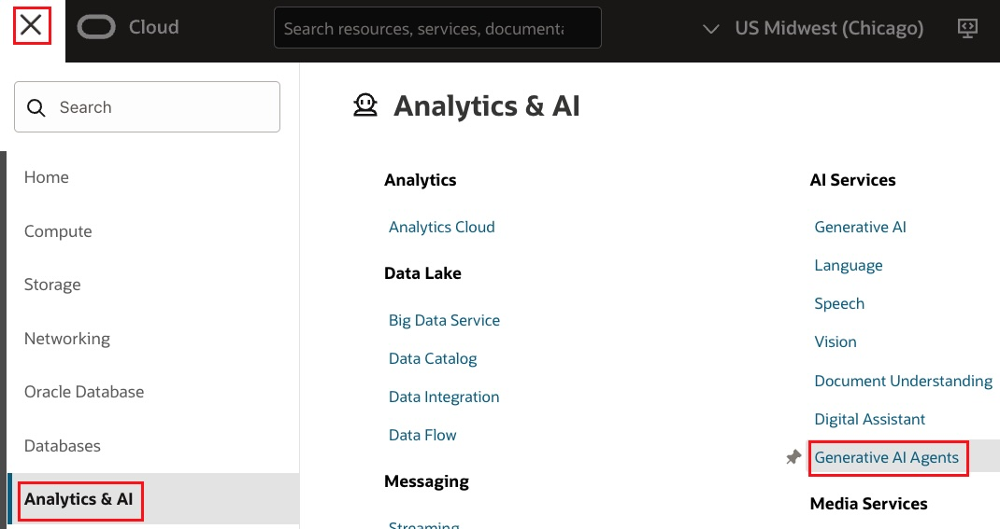

5. In the overview page, click the **Agents** link.

6. Under the **List scope** section, make sure that your compartment is selected.

7. Click the **Create Agent** button at the top of the Agents table.

   

8. For the **Name** field use:

    ```text
    merchandising insights agent
    ```

9. For the **Compartment** field, make sure that your compartment is selected.

10. For the **Description** field, use:

    ```text
    This agent assists the Chief Merchandising Officer in analyzing return trends, identifying product defects, evaluating supplier performance, and uncovering regional patterns to optimize merchandising decisions.
    ```

11. For the **Welcome message** field, use:

    ```text
    Hello! I'm your Merchandising Insights Assistant. I can help you analyze return trends, evaluate supplier quality, identify product issues, and answer questions about our merchandising policies. How can I assist you today?
    ```

12. Click the **Next** button.

## Task 2: Add the RAG Tool

1. Under the **Tools** section, click the **Add tool** button to create our first tool.

   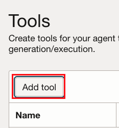

2. Select the **RAG tool** option.

3. Under the RAG Configuration section, use the following in the **Name** field:

    ```text
    Merchandising Policy Knowledge Base
    ```

4. For the **Description** field, use:

    ```text
    Use this tool when users ask about policies, standards, thresholds, or procedures. Retrieves merchandising policies including: Supplier Quality Standards (ratings, status classifications, defect thresholds), RTV Claim Policy (eligibility, deadlines, recovery rates), Product Return Thresholds (category benchmarks, escalation triggers), Defective Merchandise Handling (classification, remediation, disposition), Regional Distribution Guidelines (packaging requirements, damage benchmarks), Supplier Probation Procedures (triggers, process, exit criteria), Inventory Disposition Policy (categories, decision tree, timelines), and Customer Return Policy (windows, conditions, refund methods).
    ```

    It is very important to provide a high-level description of the knowledge that this tool can retrieve. This allows the agent to make accurate decisions when choosing to invoke this tool.

   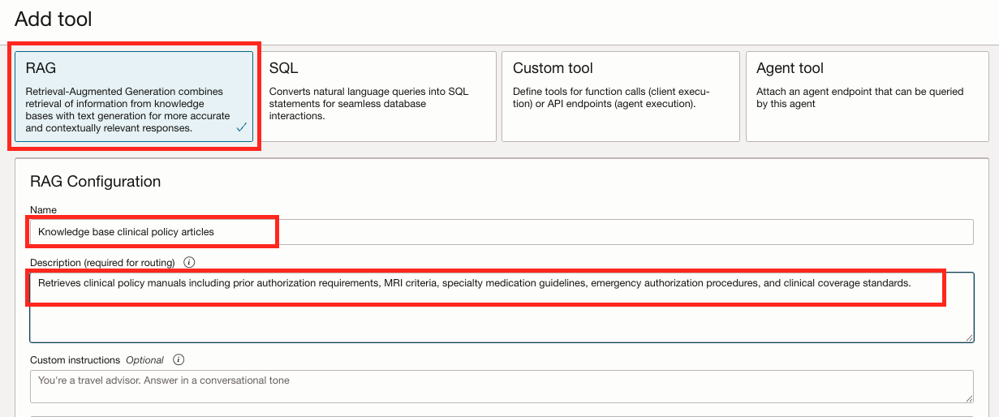

5. Under the **Add knowledge bases** section, make sure that your compartment is selected in the **Compartment** field.

6. Click the **Create knowledge base** button. In this step we are going to create a knowledge base which references the storage bucket into which we've uploaded the merchandising policy documents.

      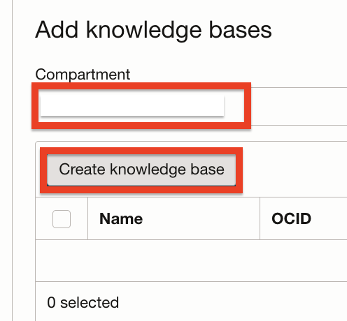

7. In the New knowledge base form, use the following for the **Name** field:

    ```text
    Merchandising Policy Documents
    ```

8. Make sure that your compartment is selected in the **Compartment** field.

9. In the **Data store type** field, we will select **Object storage** to be able to retrieve information from our storage bucket.

10. Make sure that **Enable hybrid search** is checked. Enabling this option instructs the system to combine lexical and semantic search when scanning our documents.

11. Click the **Specify data source** button.

   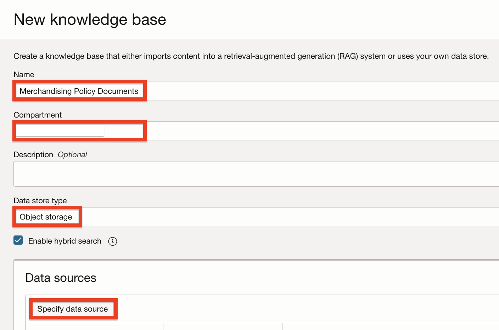

12. In the Specify data source form, use the following for the **Name** field:

    ```text
    merchandising policy docs
    ```

13. Make sure that the **Enable multi-modal parsing** option is not checked. This option enable parsing of rich content, such as charts and graphics, to allow responses based on visual elements. However, we do not have any images in our policy documents so right now this option is not required.

14. Under the **Data bucket** option, select the **retail-merchandising-policies** bucket into which we've previously uploaded the policy PDF files.

15. Check the **Select all in bucket** option. This option will automatically flag all of the file in the bucket for ingestion instead of us having to select each file individually.

16. Click the **Create** button.

   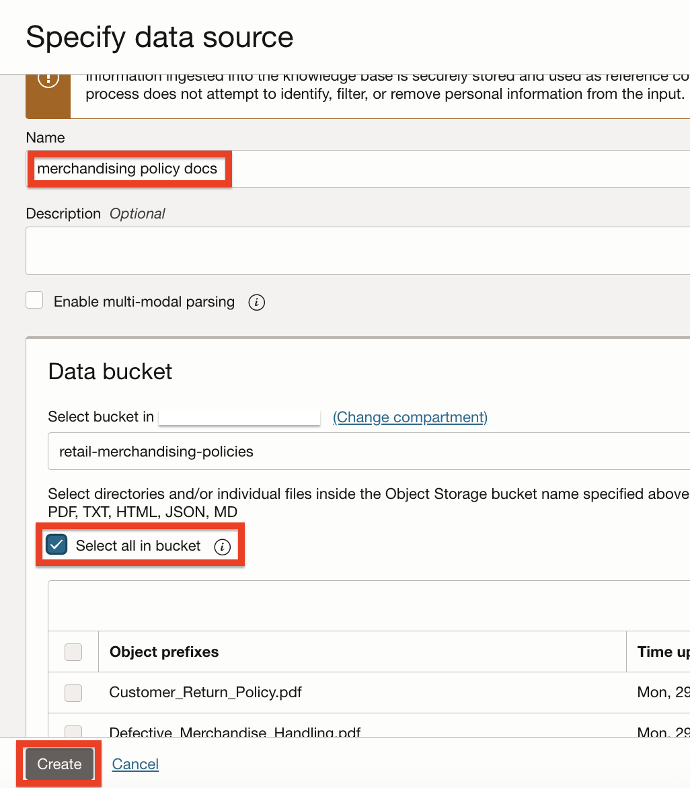

17. Back in the New knowledge base panel, the `merchandising policy docs` data source was added to the Data source table.

18. Make sure that the **Automatically start ingestion job for above data sources** option is checked. This will create an ingestion job which will scan all of our files automatically when the knowledge base is initially created. Please note that this will only run the ingestion job once. In order to re-ingest information from the bucket in the future, you will need to trigger a job manually.

19. Click the **Create** button.

     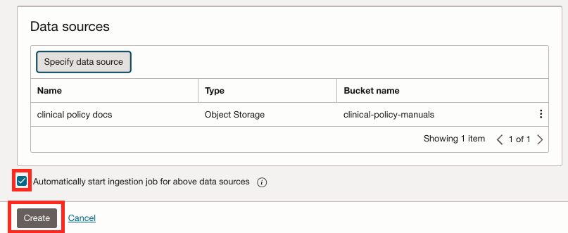

20. The knowledge base will take a few minutes to create and ingest the data. You may proceed to the next step while the knowledge base provisions.

21. Back at the Add knowledge bases panel, make sure that the checkbox next to the knowledge base name is checked.

> 💡 If your knowledge base does not appear ("No items found"), you can still continue to the next step. The knowledge base is already selected and provisioning in the background. You may open a new tab and navigate to Agents > Knowledge Bases to confirm it is provisioning.

22. Click the **Add tool** button.

   

## Task 3: Add the SQL Tool

1. Now that we have our RAG tool configured, let's configure our SQL tool. In the Tools section click the **Add tool** button.

    

2. Click the **SQL** option.

3. For the **Name** field, use:

    ```text
    Retail Merchandising Database
    ```

4. For the **Description** field, use:

    ```text
    Use this tool when users ask about products, suppliers, stores, returns, defects, or regional patterns. Contains database tables for: Products (SKU, name, category, supplier, pricing), Suppliers (name, quality rating, status, defect counts), Stores (name, city, region, type), Return Reasons (codes like DEF001, DEF002, DMG001, categories), and Return Transactions (product, store, reason, date, condition, disposition, RTV status).
    ```
   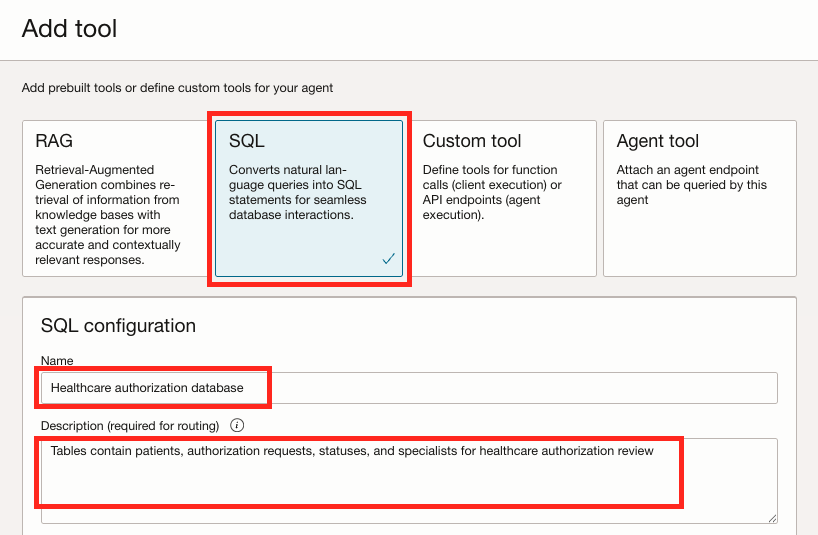

5. Under **Import database schema configuration for this tool**, select the **Inline** option which will allow us to use the same schema text we've used when we created the database.

6. Copy the following text and paste it into the **Database schema** field:

    ```sql
    CREATE TABLE Suppliers (
        SupplierID           NUMBER PRIMARY KEY,
        SupplierName         VARCHAR2(100) NOT NULL,
        ContactEmail         VARCHAR2(100),
        ContactPhone         VARCHAR2(20),
        Region               VARCHAR2(50),
        QualityRating        NUMBER(2,1),
        ContractStatus       VARCHAR2(20),
        DefectReturnCount    NUMBER DEFAULT 0,
        LastQualityReview    DATE,
        QualityStatus        VARCHAR2(20)
    );

    CREATE TABLE Products (
        ProductID            NUMBER PRIMARY KEY,
        SKU                  VARCHAR2(20) UNIQUE NOT NULL,
        ProductName          VARCHAR2(100) NOT NULL,
        Category             VARCHAR2(50),
        SubCategory          VARCHAR2(50),
        SupplierID           NUMBER NOT NULL,
        UnitCost             NUMBER(10,2),
        UnitPrice            NUMBER(10,2),
        LaunchDate           DATE
    );

    CREATE TABLE Stores (
        StoreID              NUMBER PRIMARY KEY,
        StoreName            VARCHAR2(100) NOT NULL,
        City                 VARCHAR2(50),
        State                VARCHAR2(2),
        Region               VARCHAR2(50),
        StoreType            VARCHAR2(20)
    );

    CREATE TABLE Return_Reasons (
        ReasonID             NUMBER PRIMARY KEY,
        ReasonCode           VARCHAR2(20) NOT NULL,
        ReasonDescription    VARCHAR2(100) NOT NULL,
        ReasonCategory       VARCHAR2(50)
    );

    CREATE TABLE Return_Transactions (
        ReturnID             NUMBER PRIMARY KEY,
        TransactionID        VARCHAR2(20) UNIQUE NOT NULL,
        ProductID            NUMBER NOT NULL,
        StoreID              NUMBER NOT NULL,
        ReasonID             NUMBER NOT NULL,
        ReturnDate           DATE NOT NULL,
        QuantityReturned     NUMBER DEFAULT 1,
        RefundAmount         NUMBER(10,2),
        ReturnCondition      VARCHAR2(20),
        DispositionAction    VARCHAR2(20),
        RTVClaimed           VARCHAR2(3)
    );
    ```

7. Under the **In-context learning examples**, leave the **None** option selected.

8. Under the **Description of tables and columns**, select the **Inline** option.

9. Copy and paste the following text into the **Description of tables and columns**. This verbal description contains details about each table and column. This will allow the tool to better understand the data stored in our database:

    ```text
    IMPORTANT JOIN PATHS:
    - To link Returns to Suppliers: Return_Transactions → Products (via ProductID) → Suppliers (via SupplierID)
    - To link Returns to Stores: Return_Transactions → Stores (via StoreID)
    - To link Returns to Reasons: Return_Transactions → Return_Reasons (via ReasonID)
    - Defect-related returns have ReasonCategory = 'Defect' (reason codes DEF001, DEF002)
    - Damage-related returns have ReasonCategory = 'Damage' (reason code DMG001)

    Suppliers — Vendor directory with quality tracking.
      SupplierID (number): PK
      SupplierName (string): Company name
      ContactEmail, ContactPhone: Contact information
      Region (string): Geographic region (Midwest, West, Southeast, Northeast, Southwest)
      QualityRating (number): Quality score from 1.0 to 5.0
      ContractStatus (string): Active, Probation, or Terminated
      DefectReturnCount (number): Count of defect-related returns
      LastQualityReview (date): Date of most recent quality review
      QualityStatus (string): Good Standing, Under Review, or Probation

    Products — Product catalog. Each product belongs to one supplier.
      ProductID (number): PK
      SKU (string): Stock keeping unit (e.g., APP-ESP-001)
      ProductName (string): Product display name
      Category (string): Appliances, Electronics, Home Goods, Furniture
      SubCategory (string): More specific category
      SupplierID (number): FK → Suppliers.SupplierID (join Products to Suppliers on this column)
      UnitCost (number): Cost to company
      UnitPrice (number): Retail price
      LaunchDate (date): Product launch date

    Stores — Store locations for regional analysis.
      StoreID (number): PK
      StoreName (string): Store display name
      City, State: Location
      Region (string): Northeast, Southeast, Midwest, Southwest, West
      StoreType (string): Flagship, Standard, or Outlet

    Return_Reasons — Standardized return reason codes.
      ReasonID (number): PK
      ReasonCode (string): DEF001 (defective), DEF002 (missing parts), DMG001 (shipping damage), PRF001 (changed mind), PRF002 (wrong size/color), WRG001 (wrong item)
      ReasonDescription (string): Human-readable description
      ReasonCategory (string): Defect, Damage, Preference, Wrong Item

    Return_Transactions — Individual return records. Join to Products to get supplier info.
      ReturnID (number): PK
      TransactionID (string): Unique transaction ID (e.g., RTN-2025-0001)
      ProductID (number): FK → Products.ProductID (join to Products, then Products to Suppliers)
      StoreID (number): FK → Stores.StoreID
      ReasonID (number): FK → Return_Reasons.ReasonID
      ReturnDate (date): Date of return
      QuantityReturned (number): Number of units returned
      RefundAmount (number): Amount refunded to customer
      ReturnCondition (string): New, Opened, Damaged, or Defective
      DispositionAction (string): Restock, Outlet, Refurbish, Dispose, or RTV
      RTVClaimed (string): Yes or No - whether RTV claim was filed
    ```

   

10. For **Model customization**, select the **Small** option.

11. For **Dialect**, select **Oracle SQL**.

12. In the **Database tool connection**, select your compartment, then choose the **retail-merchandising** connection we previously created.

> 💡 If your database tool connection does not appear in your compartment ("Option not available"), select Cancel and re-add the SQL tool by repeating Task 3: Add the SQL Tool.

13. Click the **Test connection** button. You should see a successful connection attempt.

14. Enable the **SQL execution** option. This option will instruct the tool to execute the SQL queries generated by the tool as a result of the user's requests. This will allow the agent to craft intelligent responses based on the data returned from the queries.

15. Enable the **Self correction** option. Enabling this option will allow the tool to automatically detect and correct syntax errors in generated SQL queries.

16. Click the **Add tool** button.

   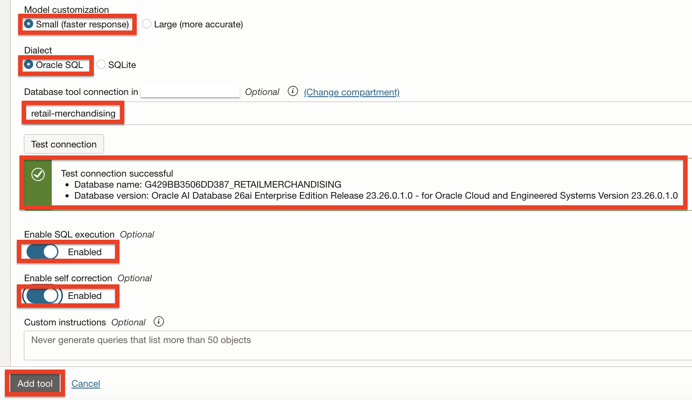

17. Back in the Tools section, click **Next**.

   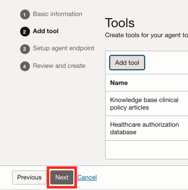

## Task 4: Setup the Agent Endpoint

1. In the **Setup agent endpoint** section, check the **Automatically create an endpoint for this agent**.

2. Enable the **Enable human in the loop** option. This will enable the agent to ask for additional human input or information if needed.

      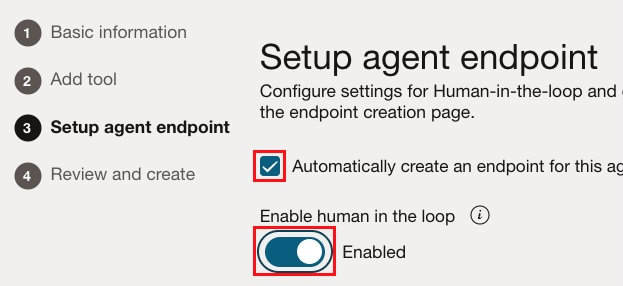

3. We are going to leave all of the options under **Guardrails** for Content moderation, Prompt injection (PI) protection & Personally identifiable information (PII) protection sections as **Disabled**. Those options are important but not required for our demonstration. Please refer to the Learn More section below for additional information about those options.

4. Click the **Next** button.

      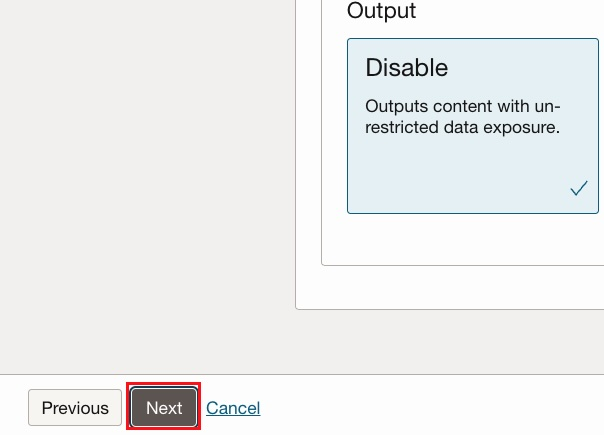

## Task 5: Review and Create

1. In the **Review and create** page, review the agent information and click the **Create agent** button.

      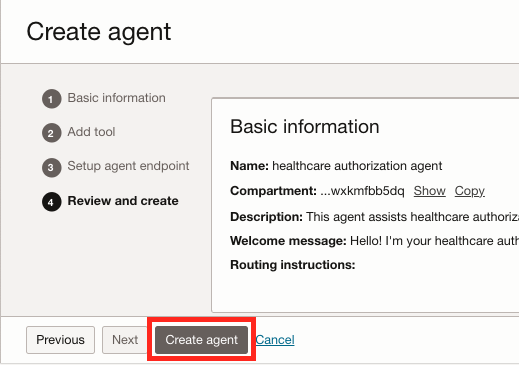
   
2. In the license agreement dialog, review the agreement, check the consent checkbox and click the **Submit** button.

      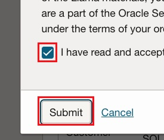

3. The agent will take a few minutes to create. When complete, the agent's **Lifecycle state** will show **Active**.

   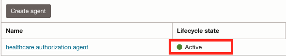
## Summary

You have successfully completed this lab. You have:

- Created the Merchandising Insights Agent
- Configured the RAG tool with the merchandising policy knowledge base
- Configured the SQL tool with the retail merchandising database schema
- Set up the agent endpoint with human-in-the-loop enabled

You may now proceed to the next lab.

## Learn More

- [Creating an Agent in Generative AI Agents](https://docs.oracle.com/en-us/iaas/Content/generative-ai-agents/create-agent.htm)
- [Add AI Guardrails to OCI Generative AI Model Endpoints](https://docs.oracle.com/en-us/iaas/Content/generative-ai-agents/guardrails.htm)

## Acknowledgements

- **Author** - Deion Locklear 
- **Contributors** - Hanna Rakhsha, Daniel Hart, Uma Kumar, Anthony Marino
