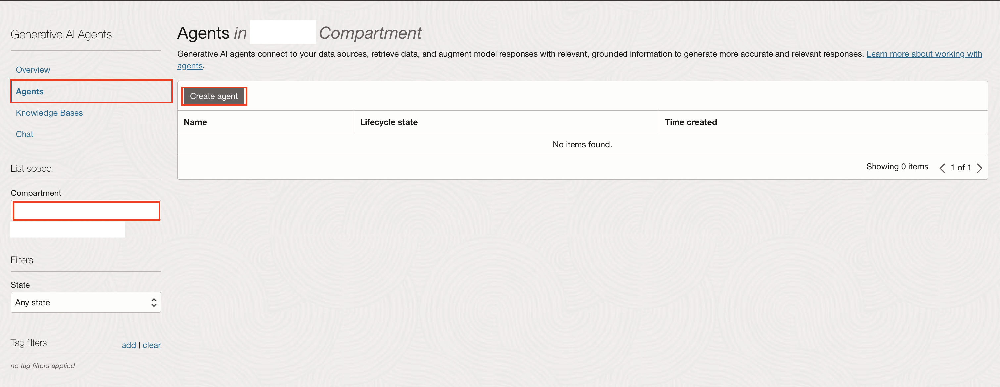
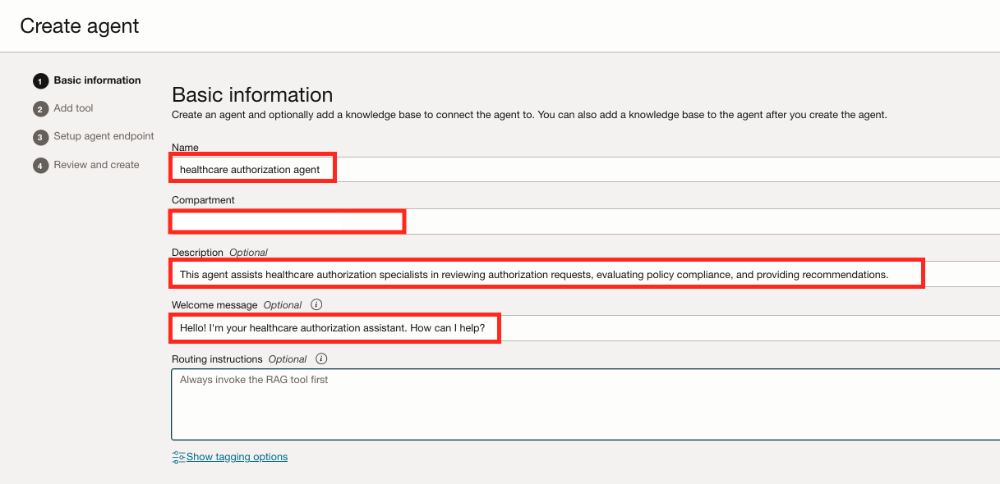
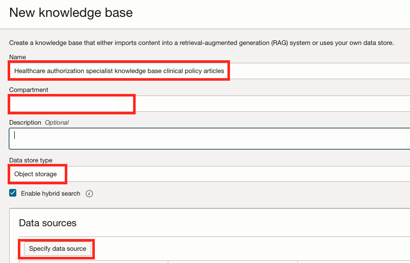
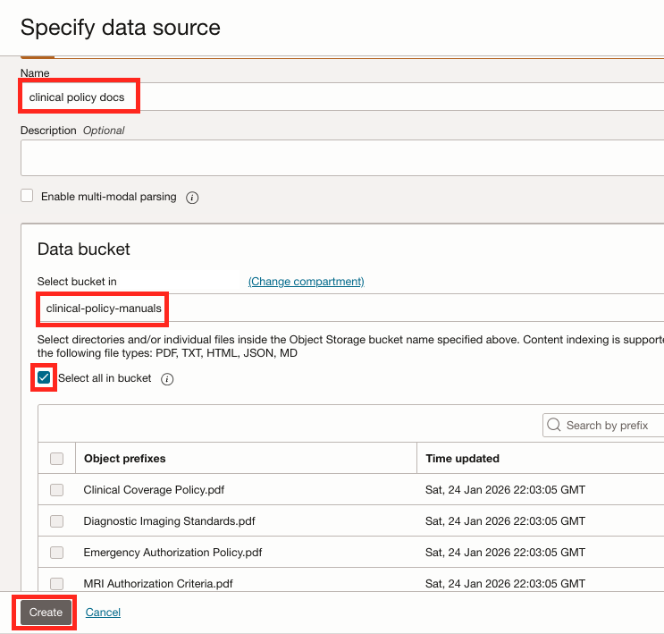
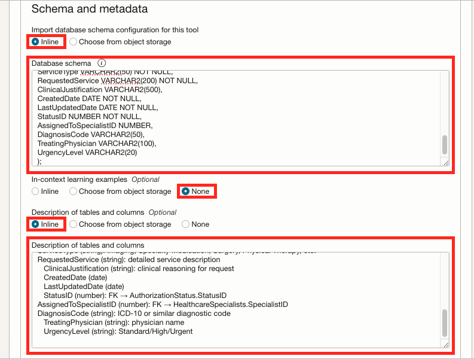
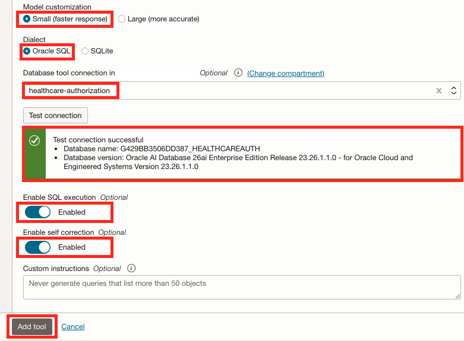

# Create the Agent

## Introduction

In this lab we are going to create the intelligent agent which will drive our entire solution. We will provide the agent with the required tools and knowledge bases to perform it's work effectively. Tools are resources the agent can use to perform it's tasks. In our use-case, we are going to use two tools:

- **RAG Tool** - Which will scan the clinical policy manuals uploaded to object storage whenever the user requires such information.
- **SQL Tool** - Which will be able to retrieve information stored in our ADB instance relating to the healthcare authorization system.

Estimated Time: 15 minutes

### Objectives

In this lab, you will:

- Create our agent including the RAG & SQL Tools and assign the relevant knowledge base to each.

### Prerequisites

This lab assumes you have:

- All previous labs successfully completed.

## Task 1: Create the agent

1. Click the navigation menu on the top left.
1. Click **Analytics & AI**.
1. Click **Generative AI Agents**.

   

1. In the overview page, click the **Agents** link
1. Under the **List scope** section, make sure that your compartment is selected.
1. Click the **Create Agent** button at the top of the **Agents** table.

   

1. For the **Name** field use: _healthcare authorization agent_
1. For the **Compartment** field, make sure that your compartment is selected.
1. For the **Description** field, use: _This agent assists healthcare authorization specialists in reviewing authorization requests, evaluating policy compliance, and providing recommendations._
1. For the **Welcome message** field, use: _Hello! I'm your healthcare authorization assistant. How can I help?_
1. Click the **Next** button.

   

## Task 2: Add the RAG Tool

1. Under the **Tools** section, click the **Add tool** button to create our first tool.

   

1. Select the **RAG** tool option.
1. Under the **RAG Configuration** section, use _Knowledge base clinical policy articles_ in the **Name** field.
1. For the **Description** field, use: _Retrieves clinical policy manuals including prior authorization requirements, MRI criteria, specialty medication guidelines, emergency authorization procedures, and clinical coverage standards_.

   It is very important to provide a high-level description of the knowledge that this tool can retrieve. This allows the agent to make accurate decisions when choosing to invoke this tool.

   

1. Under the **Add knowledge bases** section, make sure that your compartment is selected in the **Compartment** field.
1. Click the **Create knowledge base** button. In this step we are going to create a knowledge base which references the storage bucket into which we've uploaded the clinical policy manuals.

   

1. In the **New knowledge base** form, use: _Healthcare authorization specialist knowledge base clinical policy articles_ for the **Name** field.
1. Make sure that your compartment is selected in the **Compartment** field.
1. In the **Data store type** field, we will select **Object storage** to be able to retrieve information from our storage bucket.
1. Make sure that **Enable hybrid search** is checked. Enabling this option instructs the system to combine lexical and semantic search when scanning our documents.
1. Click the **Specify data source** button.

   

1. In the **Specify data source** form, use: _clinical policy docs_ for the **Name** field.
1. Make sure that the **Enable multi-modal parsing** option is **not** checked. This option enable parsing of rich content, such as charts and graphics, to allow responses based on visual elements. However, we do not have any images in our policy documents so right now this option is not required.
1. Under the **Data bucket** option, select the _clinical-policy-manuals_ bucket into which we've previously uploaded the clinical policy PDF files.
1. Check the **Select all in bucket option**. This option will automatically flag all of the file in the bucket for ingestion instead of us having to select each file individually.
1. Click the **Create** button.

   

1. Back in the **New knowledge base** panel, the **clinical policy docs** data source was added to the **Data source** table.
1. Make sure that the **Automatically start ingestion job for above data sources** option is checked. This will create an ingestion job which will scan all of our files automatically when the knowledge base is initially created. Please note that this will only run the ingestion job once. In order to re-ingest information from the bucket in the future, you will need to trigger a job manually.
1. Click the **Create** button.

   

1. The knowledge base will take a few minutes to create and ingest the data.
1. Back at the **Add knowledge bases** panel, make sure that the checkbox next to the knowledge base name is checked.
   >💡 _If your knowledge base does not appear ("No items found"), you can still continue to the next step. The knowledge base is already selected and provisioning in the background. You may open a new tab and navigate to Agents > Knowledge Bases to confirm it is provisioning._

1. Click the **Add tool** button.

   

## Task 3: Add the SQL Tool

1. Now that we have our RAG tool configured, let's configure our SQL tool. In the **Tools** section Click the **Add tool** button.

   

1. Click the **SQL** option.
1. For the **Name** field, use: _Healthcare authorization database_.
1. For the **Description** field, use: _Tables contain patients, authorization requests, statuses, and specialists for healthcare authorization review._.

   

1. Under **Import database schema configuration for this tool**, select the **Inline** option which will allow us to use the same schema text we've used when we created the database.
1. Copy the following text and paste it into the **Database schema** field:

      ```sql
      <copy>
      CREATE TABLE Patients (
      PatientID NUMBER PRIMARY KEY,
      ExternalPatientID VARCHAR2(20) UNIQUE,
      FirstName VARCHAR2(50) NOT NULL,
      LastName  VARCHAR2(50) NOT NULL,
      Address   VARCHAR2(200),
      City      VARCHAR2(50),
      State     VARCHAR2(2),
      ZipCode   VARCHAR2(10),
      Age NUMBER,
      Gender VARCHAR2(10),
      PrimaryInsurance VARCHAR2(100),
      SecondaryInsurance VARCHAR2(100)
      );
      CREATE TABLE HealthcareSpecialists (
      SpecialistID NUMBER PRIMARY KEY,
      FirstName VARCHAR2(50) NOT NULL,
      LastName  VARCHAR2(50) NOT NULL,
      Email VARCHAR2(100) UNIQUE NOT NULL,
      Phone VARCHAR2(20)
      );
      CREATE TABLE AuthorizationStatus (
      StatusID NUMBER PRIMARY KEY,
      StatusName VARCHAR2(50) NOT NULL
      );
      CREATE TABLE AuthorizationRequests (
      AuthorizationID NUMBER PRIMARY KEY,
      RequestID NUMBER UNIQUE NOT NULL,
      PatientID NUMBER NOT NULL,
      ServiceType VARCHAR2(50) NOT NULL,
      RequestedService VARCHAR2(200) NOT NULL,
      ClinicalJustification VARCHAR2(500),
      CreatedDate DATE NOT NULL,
      LastUpdatedDate DATE NOT NULL,
      StatusID NUMBER NOT NULL,
      AssignedToSpecialistID NUMBER,
      DiagnosisCode VARCHAR2(50),
      TreatingPhysician VARCHAR2(100),
      UrgencyLevel VARCHAR2(20)
      );
      </copy>
      ```

1. Under the **Description of tables and columns**, select the **Inline** option.
1. Copy and paste the following text into the **Description of tables and columns**. This verbal description contains details about each table and column. This will allow the tool to better understand the data stored in our database:

      ```text
      <copy>
      Patients — patient demographic and insurance details.
         PatientID (number): PK
      ExternalPatientID (string): business ID (e.g., PAT_22000)
         FirstName, LastName, Address, City, State, ZipCode
      Age (number)
         Gender (string): Male/Female/Other
         PrimaryInsurance (string): primary insurance provider
         SecondaryInsurance (string): secondary insurance provider if applicable
      HealthcareSpecialists — specialist directory.
         SpecialistID (number): PK
      FirstName, LastName, Email, Phone
      AuthorizationStatus — authorization request lifecycle statuses.
         StatusID (number): PK
      StatusName (string): one of Pending Review, In Progress, Approved, Denied
      AuthorizationRequests — each authorization request and its state.
         AuthorizationID (number): PK
      RequestID (number): external request ID (unique)
         PatientID (number): FK → Patients.PatientID
      ServiceType (string): Imaging, Specialty Medication, Surgery, Physical Therapy, etc.
      RequestedService (string): detailed service description
         ClinicalJustification (string): clinical reasoning for request
         CreatedDate (date)
         LastUpdatedDate (date)
         StatusID (number): FK → AuthorizationStatus.StatusID
      AssignedToSpecialistID (number): FK → HealthcareSpecialists.SpecialistID
      DiagnosisCode (string): ICD-10 or similar diagnostic code
         TreatingPhysician (string): physician name
         UrgencyLevel (string): Standard/High/Urgent


      </copy>
      ```

   

1. For **Model customization**, select the **Small** option.
1. For **Dialect**, select **Oracle SQL**.
1. In the **Database tool connection in...** select the **connection-healthcareauthorizationXXXX** connection we've previously created.
   >💡 _If your database tool connection does not appear ("Option not available"), select Cancel and re-add the SQL tool by repeating Task 3: Add the SQL Tool_

1. Click the **Test connection** button. You should see a successful connection connection attempt.
1. Enable the **SQL execution** option. This option will instruct the tool to execute the SQL queries generated by the tool as a result of the user's requests. This will allow the agent to craft intelligent responses based on the data returned from the queries.
1. Enable the **Self correction** option. Enabling this option will allow the tool to automatically detect and correct syntax errors in generated SQL queries.

1. Click the **Add tool** button.

   

1. Back in the **Tools** section, Click **Next**

   

## Task 4: Setup the Agent Endpoint

1. In the **Setup agent endpoint** section, check the **Automatically create an endpoint for this agent**.
1. Enable the **Enable human in the loop** option. This will enable the agent to ask for additional human input or information if needed.

   

1. We are going to leave all of the options under **Guardrails** for **Content moderation**, **Prompt injection (PI) protection** & **Personally identifiable information (PII) protection** sections as **Disabled**. Those options are important but not required for our demonstration. Please refer to the **Learn More** section below for additional information about those options.
1. Click the **Next** button.

   

## Task 5: Review and Create

1. In the **Review and create** page, review the agent information and click the **Create agent** button.

   

1. In the license agreement dialog, review the agreement, check the consent checkbox and click the **Submit** button.

   

1. The agent will take a few minutes to create. When complete, the agent's **Lifecycle state** will show **Active**.

You may now **proceed to the next lab**

## Learn More

- [Creating an Agent in Generative AI Agents](https://docs.oracle.com/en-us/iaas/Content/generative-ai-agents/create-agent.htm#create-agent)
- [Add AI Guardrails to OCI Generative AI Model Endpoints](https://docs.oracle.com/en-us/iaas/releasenotes/generative-ai/ai-guardrails.htm)

## Acknowledgements

- **Author** - Wynne Yang, Daniel Hart
- **Contributors** - Hanna Rakhsha, Daniel Hart, Uma Kumar, Anthony Marino
- **Last Updated By/Date** - Wynne Yang Feb 2026